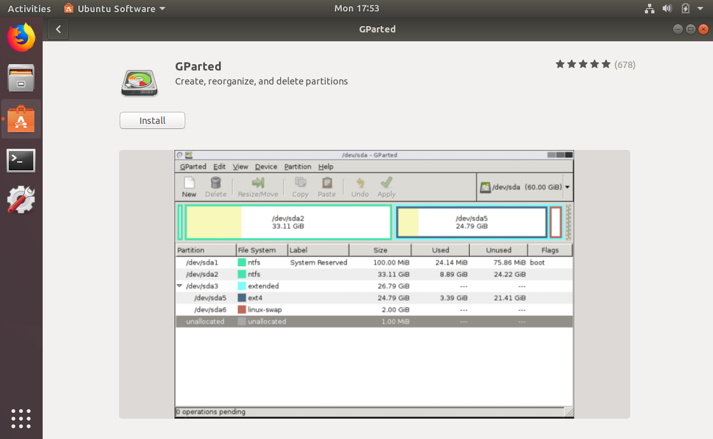

# Utilizing Your Existing microSD Boot Card for Your Media Files

A the time of writing this walkthrough, the prices for a 16 Gb microSD card are lower than the price of an 8 Gb card.  The ConnectBox microSD card only really requires around 2 Gb of space for the OS to properly operate.  That means that you essentially waste a lot of the capacity of your microSD card.

If you are one of those groups that has essentially static content that you want to distribute via a ConnectBox, you probably want to consider modifying your microSD card so that you can create a media partition on it that is accessable from another, more standard, computer (e.g., Windows or Mac). This will allow you to only need the one microSD card that does both the ConnectBox OS boot and also contains your media. You will save some costs and time by only using the one microSD card.

If you have content that might change more frequently, this is probably a bad option for you as it will require the end user to take apart the ConnectBox case each time that something needs to be updated. This process really is for when you have relatively static media content that you want to distribute around and not have to open up the ConnectBox case. It is ideal for rapidly duplicating content to other microSD cards.

## Step 1: Resizing the Boot OS on the microSD

Once your base ConnectBox image has been burned to a microSD card, the first step is to resize that partion down from taking up the entire card's space to only that which is necessary for the OS to boot and operate the device. Since this is a Linux partition, the easiest way to resize the card is to complete the action within a graphical Linux OS (i.e., Ubuntu or Debian). From the Linux Desktop (in this case I'll be using an Ubuntu 16.04 computer), you'll want to install the program `gparted`. Do a search for the program and if it doesn't show up, it should prompt you to install it. 



Once you do that then run it.


Eject disk from Ubuntu


```BASH
root@connectbox:~# lsblk -f
NAME        FSTYPE LABEL   UUID                                 MOUNTPOINT
sda
└─sda1      vfat   KAISER  F65C-E2C0                            /media/usb0
mmcblk0
├─mmcblk0p2 vfat   WINSIDE D2D0-8176
└─mmcblk0p1 ext4           50046acd-904a-492b-8e10-c2fc66e67ce4 /
```

`UUID=D2D0-8176 /media/usb0 vfat sync,noexec,nodev,noatime,nodiratime,utf8`