<html xmlns:v="urn:schemas-microsoft-com:vml"
xmlns:o="urn:schemas-microsoft-com:office:office"
xmlns:w="urn:schemas-microsoft-com:office:word"
xmlns:dt="uuid:C2F41010-65B3-11d1-A29F-00AA00C14882"
xmlns:m="http://schemas.microsoft.com/office/2004/12/omml"
xmlns="http://www.w3.org/TR/REC-html40">

<head>
<meta http-equiv=Content-Type content="text/html; charset=windows-1252">
<meta name=ProgId content=Word.Document>
<meta name=Generator content="Microsoft Word 15">
<meta name=Originator content="Microsoft Word 15">
<link rel=File-List href="ConnectBox-GettingStarted_V7_files/filelist.xml">
<link rel=Edit-Time-Data href="ConnectBox-GettingStarted_V7_files/editdata.mso">
<!--[if !mso]>

<![endif]-->
<title>Microsoft Word - Getting Started Guide to Your ConnectBox.docx</title>
<!--[if gte mso 9]><xml>
 <o:DocumentProperties>
  <o:Author>dirk</o:Author>
  <o:LastAuthor>Kirk Wilson</o:LastAuthor>
  <o:Revision>2</o:Revision>
  <o:TotalTime>4072</o:TotalTime>
  <o:Created>2022-09-17T16:54:00Z</o:Created>
  <o:LastSaved>2022-09-17T16:54:00Z</o:LastSaved>
  <o:Pages>30</o:Pages>
  <o:Words>5076</o:Words>
  <o:Characters>28938</o:Characters>
  <o:Lines>241</o:Lines>
  <o:Paragraphs>67</o:Paragraphs>
  <o:CharactersWithSpaces>33947</o:CharactersWithSpaces>
  <o:Version>16.00</o:Version>
 </o:DocumentProperties>
 <o:CustomDocumentProperties>
  <o:Created dt:dt="date">2018-01-30</o:Created>
  <o:Creator dt:dt="string">Acrobat PDFMaker 18 for Word</o:Creator>
  <o:LastSaved dt:dt="date">2018-04-25</o:LastSaved>
 </o:CustomDocumentProperties>
</xml><![endif]-->
<link rel=dataStoreItem href="ConnectBox-GettingStarted_V7_files/item0001.xml"
target="ConnectBox-GettingStarted_V7_files/props002.xml">
<link rel=themeData href="ConnectBox-GettingStarted_V7_files/themedata.thmx">
<link rel=colorSchemeMapping
href="ConnectBox-GettingStarted_V7_files/colorschememapping.xml">
<!--[if gte mso 9]><xml>
 <w:WordDocument>
  <w:SpellingState>Clean</w:SpellingState>
  <w:GrammarState>Clean</w:GrammarState>
  <w:TrackMoves>false</w:TrackMoves>
  <w:TrackFormatting/>
  <w:PunctuationKerning/>
  <w:ValidateAgainstSchemas/>
  <w:SaveIfXMLInvalid>false</w:SaveIfXMLInvalid>
  <w:IgnoreMixedContent>false</w:IgnoreMixedContent>
  <w:AlwaysShowPlaceholderText>false</w:AlwaysShowPlaceholderText>
  <w:DoNotPromoteQF/>
  <w:LidThemeOther>EN-US</w:LidThemeOther>
  <w:LidThemeAsian>JA</w:LidThemeAsian>
  <w:LidThemeComplexScript>X-NONE</w:LidThemeComplexScript>
  <w:Compatibility>
   <w:BreakWrappedTables/>
   <w:SnapToGridInCell/>
   <w:WrapTextWithPunct/>
   <w:UseAsianBreakRules/>
   <w:UseWord2010TableStyleRules/>
   <w:DontGrowAutofit/>
   <w:SplitPgBreakAndParaMark/>
  </w:Compatibility>
  <w:DoNotOptimizeForBrowser/>
  <m:mathPr>
   <m:mathFont m:val="Cambria Math"/>
   <m:brkBin m:val="before"/>
   <m:brkBinSub m:val="&#45;-"/>
   <m:smallFrac m:val="off"/>
   <m:dispDef/>
   <m:lMargin m:val="0"/>
   <m:rMargin m:val="0"/>
   <m:defJc m:val="centerGroup"/>
   <m:wrapIndent m:val="1440"/>
   <m:intLim m:val="subSup"/>
   <m:naryLim m:val="undOvr"/>
  </m:mathPr></w:WordDocument>
</xml><![endif]--><!--[if gte mso 9]><xml>
 <w:LatentStyles DefLockedState="false" DefUnhideWhenUsed="false"
  DefSemiHidden="false" DefQFormat="false" DefPriority="99"
  LatentStyleCount="376">
  <w:LsdException Locked="false" Priority="0" QFormat="true" Name="Normal"/>
  <w:LsdException Locked="false" Priority="9" QFormat="true" Name="heading 1"/>
  <w:LsdException Locked="false" Priority="9" SemiHidden="true"
   UnhideWhenUsed="true" QFormat="true" Name="heading 2"/>
  <w:LsdException Locked="false" Priority="9" SemiHidden="true"
   UnhideWhenUsed="true" QFormat="true" Name="heading 3"/>
  <w:LsdException Locked="false" Priority="9" SemiHidden="true"
   UnhideWhenUsed="true" QFormat="true" Name="heading 4"/>
  <w:LsdException Locked="false" Priority="9" SemiHidden="true"
   UnhideWhenUsed="true" QFormat="true" Name="heading 5"/>
  <w:LsdException Locked="false" Priority="9" SemiHidden="true"
   UnhideWhenUsed="true" QFormat="true" Name="heading 6"/>
  <w:LsdException Locked="false" Priority="9" SemiHidden="true"
   UnhideWhenUsed="true" QFormat="true" Name="heading 7"/>
  <w:LsdException Locked="false" Priority="9" SemiHidden="true"
   UnhideWhenUsed="true" QFormat="true" Name="heading 8"/>
  <w:LsdException Locked="false" Priority="9" SemiHidden="true"
   UnhideWhenUsed="true" QFormat="true" Name="heading 9"/>
  <w:LsdException Locked="false" SemiHidden="true" UnhideWhenUsed="true"
   Name="index 1"/>
  <w:LsdException Locked="false" SemiHidden="true" UnhideWhenUsed="true"
   Name="index 2"/>
  <w:LsdException Locked="false" SemiHidden="true" UnhideWhenUsed="true"
   Name="index 3"/>
  <w:LsdException Locked="false" SemiHidden="true" UnhideWhenUsed="true"
   Name="index 4"/>
  <w:LsdException Locked="false" SemiHidden="true" UnhideWhenUsed="true"
   Name="index 5"/>
  <w:LsdException Locked="false" SemiHidden="true" UnhideWhenUsed="true"
   Name="index 6"/>
  <w:LsdException Locked="false" SemiHidden="true" UnhideWhenUsed="true"
   Name="index 7"/>
  <w:LsdException Locked="false" SemiHidden="true" UnhideWhenUsed="true"
   Name="index 8"/>
  <w:LsdException Locked="false" SemiHidden="true" UnhideWhenUsed="true"
   Name="index 9"/>
  <w:LsdException Locked="false" Priority="39" SemiHidden="true"
   UnhideWhenUsed="true" Name="toc 1"/>
  <w:LsdException Locked="false" Priority="39" SemiHidden="true"
   UnhideWhenUsed="true" Name="toc 2"/>
  <w:LsdException Locked="false" Priority="39" SemiHidden="true"
   UnhideWhenUsed="true" Name="toc 3"/>
  <w:LsdException Locked="false" Priority="39" SemiHidden="true"
   UnhideWhenUsed="true" Name="toc 4"/>
  <w:LsdException Locked="false" Priority="39" SemiHidden="true"
   UnhideWhenUsed="true" Name="toc 5"/>
  <w:LsdException Locked="false" Priority="39" SemiHidden="true"
   UnhideWhenUsed="true" Name="toc 6"/>
  <w:LsdException Locked="false" Priority="39" SemiHidden="true"
   UnhideWhenUsed="true" Name="toc 7"/>
  <w:LsdException Locked="false" Priority="39" SemiHidden="true"
   UnhideWhenUsed="true" Name="toc 8"/>
  <w:LsdException Locked="false" Priority="39" SemiHidden="true"
   UnhideWhenUsed="true" Name="toc 9"/>
  <w:LsdException Locked="false" SemiHidden="true" UnhideWhenUsed="true"
   Name="Normal Indent"/>
  <w:LsdException Locked="false" SemiHidden="true" UnhideWhenUsed="true"
   Name="footnote text"/>
  <w:LsdException Locked="false" SemiHidden="true" UnhideWhenUsed="true"
   Name="annotation text"/>
  <w:LsdException Locked="false" SemiHidden="true" UnhideWhenUsed="true"
   Name="header"/>
  <w:LsdException Locked="false" SemiHidden="true" UnhideWhenUsed="true"
   Name="footer"/>
  <w:LsdException Locked="false" SemiHidden="true" UnhideWhenUsed="true"
   Name="index heading"/>
  <w:LsdException Locked="false" Priority="35" SemiHidden="true"
   UnhideWhenUsed="true" QFormat="true" Name="caption"/>
  <w:LsdException Locked="false" SemiHidden="true" UnhideWhenUsed="true"
   Name="table of figures"/>
  <w:LsdException Locked="false" SemiHidden="true" UnhideWhenUsed="true"
   Name="envelope address"/>
  <w:LsdException Locked="false" SemiHidden="true" UnhideWhenUsed="true"
   Name="envelope return"/>
  <w:LsdException Locked="false" SemiHidden="true" UnhideWhenUsed="true"
   Name="footnote reference"/>
  <w:LsdException Locked="false" SemiHidden="true" UnhideWhenUsed="true"
   Name="annotation reference"/>
  <w:LsdException Locked="false" SemiHidden="true" UnhideWhenUsed="true"
   Name="line number"/>
  <w:LsdException Locked="false" SemiHidden="true" UnhideWhenUsed="true"
   Name="page number"/>
  <w:LsdException Locked="false" SemiHidden="true" UnhideWhenUsed="true"
   Name="endnote reference"/>
  <w:LsdException Locked="false" SemiHidden="true" UnhideWhenUsed="true"
   Name="endnote text"/>
  <w:LsdException Locked="false" SemiHidden="true" UnhideWhenUsed="true"
   Name="table of authorities"/>
  <w:LsdException Locked="false" SemiHidden="true" UnhideWhenUsed="true"
   Name="macro"/>
  <w:LsdException Locked="false" SemiHidden="true" UnhideWhenUsed="true"
   Name="toa heading"/>
  <w:LsdException Locked="false" SemiHidden="true" UnhideWhenUsed="true"
   Name="List"/>
  <w:LsdException Locked="false" SemiHidden="true" UnhideWhenUsed="true"
   Name="List Bullet"/>
  <w:LsdException Locked="false" SemiHidden="true" UnhideWhenUsed="true"
   Name="List Number"/>
  <w:LsdException Locked="false" SemiHidden="true" UnhideWhenUsed="true"
   Name="List 2"/>
  <w:LsdException Locked="false" SemiHidden="true" UnhideWhenUsed="true"
   Name="List 3"/>
  <w:LsdException Locked="false" SemiHidden="true" UnhideWhenUsed="true"
   Name="List 4"/>
  <w:LsdException Locked="false" SemiHidden="true" UnhideWhenUsed="true"
   Name="List 5"/>
  <w:LsdException Locked="false" SemiHidden="true" UnhideWhenUsed="true"
   Name="List Bullet 2"/>
  <w:LsdException Locked="false" SemiHidden="true" UnhideWhenUsed="true"
   Name="List Bullet 3"/>
  <w:LsdException Locked="false" SemiHidden="true" UnhideWhenUsed="true"
   Name="List Bullet 4"/>
  <w:LsdException Locked="false" SemiHidden="true" UnhideWhenUsed="true"
   Name="List Bullet 5"/>
  <w:LsdException Locked="false" SemiHidden="true" UnhideWhenUsed="true"
   Name="List Number 2"/>
  <w:LsdException Locked="false" SemiHidden="true" UnhideWhenUsed="true"
   Name="List Number 3"/>
  <w:LsdException Locked="false" SemiHidden="true" UnhideWhenUsed="true"
   Name="List Number 4"/>
  <w:LsdException Locked="false" SemiHidden="true" UnhideWhenUsed="true"
   Name="List Number 5"/>
  <w:LsdException Locked="false" Priority="10" QFormat="true" Name="Title"/>
  <w:LsdException Locked="false" SemiHidden="true" UnhideWhenUsed="true"
   Name="Closing"/>
  <w:LsdException Locked="false" SemiHidden="true" UnhideWhenUsed="true"
   Name="Signature"/>
  <w:LsdException Locked="false" Priority="1" SemiHidden="true"
   UnhideWhenUsed="true" Name="Default Paragraph Font"/>
  <w:LsdException Locked="false" SemiHidden="true" UnhideWhenUsed="true"
   Name="Body Text"/>
  <w:LsdException Locked="false" SemiHidden="true" UnhideWhenUsed="true"
   Name="Body Text Indent"/>
  <w:LsdException Locked="false" SemiHidden="true" UnhideWhenUsed="true"
   Name="List Continue"/>
  <w:LsdException Locked="false" SemiHidden="true" UnhideWhenUsed="true"
   Name="List Continue 2"/>
  <w:LsdException Locked="false" SemiHidden="true" UnhideWhenUsed="true"
   Name="List Continue 3"/>
  <w:LsdException Locked="false" SemiHidden="true" UnhideWhenUsed="true"
   Name="List Continue 4"/>
  <w:LsdException Locked="false" SemiHidden="true" UnhideWhenUsed="true"
   Name="List Continue 5"/>
  <w:LsdException Locked="false" SemiHidden="true" UnhideWhenUsed="true"
   Name="Message Header"/>
  <w:LsdException Locked="false" Priority="11" QFormat="true" Name="Subtitle"/>
  <w:LsdException Locked="false" SemiHidden="true" UnhideWhenUsed="true"
   Name="Salutation"/>
  <w:LsdException Locked="false" SemiHidden="true" UnhideWhenUsed="true"
   Name="Date"/>
  <w:LsdException Locked="false" SemiHidden="true" UnhideWhenUsed="true"
   Name="Body Text First Indent"/>
  <w:LsdException Locked="false" SemiHidden="true" UnhideWhenUsed="true"
   Name="Body Text First Indent 2"/>
  <w:LsdException Locked="false" SemiHidden="true" UnhideWhenUsed="true"
   Name="Note Heading"/>
  <w:LsdException Locked="false" SemiHidden="true" UnhideWhenUsed="true"
   Name="Body Text 2"/>
  <w:LsdException Locked="false" SemiHidden="true" UnhideWhenUsed="true"
   Name="Body Text 3"/>
  <w:LsdException Locked="false" SemiHidden="true" UnhideWhenUsed="true"
   Name="Body Text Indent 2"/>
  <w:LsdException Locked="false" SemiHidden="true" UnhideWhenUsed="true"
   Name="Body Text Indent 3"/>
  <w:LsdException Locked="false" SemiHidden="true" UnhideWhenUsed="true"
   Name="Block Text"/>
  <w:LsdException Locked="false" SemiHidden="true" UnhideWhenUsed="true"
   Name="Hyperlink"/>
  <w:LsdException Locked="false" SemiHidden="true" UnhideWhenUsed="true"
   Name="FollowedHyperlink"/>
  <w:LsdException Locked="false" Priority="22" QFormat="true" Name="Strong"/>
  <w:LsdException Locked="false" Priority="20" QFormat="true" Name="Emphasis"/>
  <w:LsdException Locked="false" SemiHidden="true" UnhideWhenUsed="true"
   Name="Document Map"/>
  <w:LsdException Locked="false" SemiHidden="true" UnhideWhenUsed="true"
   Name="Plain Text"/>
  <w:LsdException Locked="false" SemiHidden="true" UnhideWhenUsed="true"
   Name="E-mail Signature"/>
  <w:LsdException Locked="false" SemiHidden="true" UnhideWhenUsed="true"
   Name="HTML Top of Form"/>
  <w:LsdException Locked="false" SemiHidden="true" UnhideWhenUsed="true"
   Name="HTML Bottom of Form"/>
  <w:LsdException Locked="false" SemiHidden="true" UnhideWhenUsed="true"
   Name="Normal (Web)"/>
  <w:LsdException Locked="false" SemiHidden="true" UnhideWhenUsed="true"
   Name="HTML Acronym"/>
  <w:LsdException Locked="false" SemiHidden="true" UnhideWhenUsed="true"
   Name="HTML Address"/>
  <w:LsdException Locked="false" SemiHidden="true" UnhideWhenUsed="true"
   Name="HTML Cite"/>
  <w:LsdException Locked="false" SemiHidden="true" UnhideWhenUsed="true"
   Name="HTML Code"/>
  <w:LsdException Locked="false" SemiHidden="true" UnhideWhenUsed="true"
   Name="HTML Definition"/>
  <w:LsdException Locked="false" SemiHidden="true" UnhideWhenUsed="true"
   Name="HTML Keyboard"/>
  <w:LsdException Locked="false" SemiHidden="true" UnhideWhenUsed="true"
   Name="HTML Preformatted"/>
  <w:LsdException Locked="false" SemiHidden="true" UnhideWhenUsed="true"
   Name="HTML Sample"/>
  <w:LsdException Locked="false" SemiHidden="true" UnhideWhenUsed="true"
   Name="HTML Typewriter"/>
  <w:LsdException Locked="false" SemiHidden="true" UnhideWhenUsed="true"
   Name="HTML Variable"/>
  <w:LsdException Locked="false" SemiHidden="true" UnhideWhenUsed="true"
   Name="Normal Table"/>
  <w:LsdException Locked="false" SemiHidden="true" UnhideWhenUsed="true"
   Name="annotation subject"/>
  <w:LsdException Locked="false" SemiHidden="true" UnhideWhenUsed="true"
   Name="No List"/>
  <w:LsdException Locked="false" SemiHidden="true" UnhideWhenUsed="true"
   Name="Outline List 1"/>
  <w:LsdException Locked="false" SemiHidden="true" UnhideWhenUsed="true"
   Name="Outline List 2"/>
  <w:LsdException Locked="false" SemiHidden="true" UnhideWhenUsed="true"
   Name="Outline List 3"/>
  <w:LsdException Locked="false" SemiHidden="true" UnhideWhenUsed="true"
   Name="Table Simple 1"/>
  <w:LsdException Locked="false" SemiHidden="true" UnhideWhenUsed="true"
   Name="Table Simple 2"/>
  <w:LsdException Locked="false" SemiHidden="true" UnhideWhenUsed="true"
   Name="Table Simple 3"/>
  <w:LsdException Locked="false" SemiHidden="true" UnhideWhenUsed="true"
   Name="Table Classic 1"/>
  <w:LsdException Locked="false" SemiHidden="true" UnhideWhenUsed="true"
   Name="Table Classic 2"/>
  <w:LsdException Locked="false" SemiHidden="true" UnhideWhenUsed="true"
   Name="Table Classic 3"/>
  <w:LsdException Locked="false" SemiHidden="true" UnhideWhenUsed="true"
   Name="Table Classic 4"/>
  <w:LsdException Locked="false" SemiHidden="true" UnhideWhenUsed="true"
   Name="Table Colorful 1"/>
  <w:LsdException Locked="false" SemiHidden="true" UnhideWhenUsed="true"
   Name="Table Colorful 2"/>
  <w:LsdException Locked="false" SemiHidden="true" UnhideWhenUsed="true"
   Name="Table Colorful 3"/>
  <w:LsdException Locked="false" SemiHidden="true" UnhideWhenUsed="true"
   Name="Table Columns 1"/>
  <w:LsdException Locked="false" SemiHidden="true" UnhideWhenUsed="true"
   Name="Table Columns 2"/>
  <w:LsdException Locked="false" SemiHidden="true" UnhideWhenUsed="true"
   Name="Table Columns 3"/>
  <w:LsdException Locked="false" SemiHidden="true" UnhideWhenUsed="true"
   Name="Table Columns 4"/>
  <w:LsdException Locked="false" SemiHidden="true" UnhideWhenUsed="true"
   Name="Table Columns 5"/>
  <w:LsdException Locked="false" SemiHidden="true" UnhideWhenUsed="true"
   Name="Table Grid 1"/>
  <w:LsdException Locked="false" SemiHidden="true" UnhideWhenUsed="true"
   Name="Table Grid 2"/>
  <w:LsdException Locked="false" SemiHidden="true" UnhideWhenUsed="true"
   Name="Table Grid 3"/>
  <w:LsdException Locked="false" SemiHidden="true" UnhideWhenUsed="true"
   Name="Table Grid 4"/>
  <w:LsdException Locked="false" SemiHidden="true" UnhideWhenUsed="true"
   Name="Table Grid 5"/>
  <w:LsdException Locked="false" SemiHidden="true" UnhideWhenUsed="true"
   Name="Table Grid 6"/>
  <w:LsdException Locked="false" SemiHidden="true" UnhideWhenUsed="true"
   Name="Table Grid 7"/>
  <w:LsdException Locked="false" SemiHidden="true" UnhideWhenUsed="true"
   Name="Table Grid 8"/>
  <w:LsdException Locked="false" SemiHidden="true" UnhideWhenUsed="true"
   Name="Table List 1"/>
  <w:LsdException Locked="false" SemiHidden="true" UnhideWhenUsed="true"
   Name="Table List 2"/>
  <w:LsdException Locked="false" SemiHidden="true" UnhideWhenUsed="true"
   Name="Table List 3"/>
  <w:LsdException Locked="false" SemiHidden="true" UnhideWhenUsed="true"
   Name="Table List 4"/>
  <w:LsdException Locked="false" SemiHidden="true" UnhideWhenUsed="true"
   Name="Table List 5"/>
  <w:LsdException Locked="false" SemiHidden="true" UnhideWhenUsed="true"
   Name="Table List 6"/>
  <w:LsdException Locked="false" SemiHidden="true" UnhideWhenUsed="true"
   Name="Table List 7"/>
  <w:LsdException Locked="false" SemiHidden="true" UnhideWhenUsed="true"
   Name="Table List 8"/>
  <w:LsdException Locked="false" SemiHidden="true" UnhideWhenUsed="true"
   Name="Table 3D effects 1"/>
  <w:LsdException Locked="false" SemiHidden="true" UnhideWhenUsed="true"
   Name="Table 3D effects 2"/>
  <w:LsdException Locked="false" SemiHidden="true" UnhideWhenUsed="true"
   Name="Table 3D effects 3"/>
  <w:LsdException Locked="false" SemiHidden="true" UnhideWhenUsed="true"
   Name="Table Contemporary"/>
  <w:LsdException Locked="false" SemiHidden="true" UnhideWhenUsed="true"
   Name="Table Elegant"/>
  <w:LsdException Locked="false" SemiHidden="true" UnhideWhenUsed="true"
   Name="Table Professional"/>
  <w:LsdException Locked="false" SemiHidden="true" UnhideWhenUsed="true"
   Name="Table Subtle 1"/>
  <w:LsdException Locked="false" SemiHidden="true" UnhideWhenUsed="true"
   Name="Table Subtle 2"/>
  <w:LsdException Locked="false" SemiHidden="true" UnhideWhenUsed="true"
   Name="Table Web 1"/>
  <w:LsdException Locked="false" SemiHidden="true" UnhideWhenUsed="true"
   Name="Table Web 2"/>
  <w:LsdException Locked="false" SemiHidden="true" UnhideWhenUsed="true"
   Name="Table Web 3"/>
  <w:LsdException Locked="false" SemiHidden="true" UnhideWhenUsed="true"
   Name="Balloon Text"/>
  <w:LsdException Locked="false" Priority="39" Name="Table Grid"/>
  <w:LsdException Locked="false" SemiHidden="true" UnhideWhenUsed="true"
   Name="Table Theme"/>
  <w:LsdException Locked="false" SemiHidden="true" Name="Placeholder Text"/>
  <w:LsdException Locked="false" Priority="1" QFormat="true" Name="No Spacing"/>
  <w:LsdException Locked="false" Priority="60" Name="Light Shading"/>
  <w:LsdException Locked="false" Priority="61" Name="Light List"/>
  <w:LsdException Locked="false" Priority="62" Name="Light Grid"/>
  <w:LsdException Locked="false" Priority="63" Name="Medium Shading 1"/>
  <w:LsdException Locked="false" Priority="64" Name="Medium Shading 2"/>
  <w:LsdException Locked="false" Priority="65" Name="Medium List 1"/>
  <w:LsdException Locked="false" Priority="66" Name="Medium List 2"/>
  <w:LsdException Locked="false" Priority="67" Name="Medium Grid 1"/>
  <w:LsdException Locked="false" Priority="68" Name="Medium Grid 2"/>
  <w:LsdException Locked="false" Priority="69" Name="Medium Grid 3"/>
  <w:LsdException Locked="false" Priority="70" Name="Dark List"/>
  <w:LsdException Locked="false" Priority="71" Name="Colorful Shading"/>
  <w:LsdException Locked="false" Priority="72" Name="Colorful List"/>
  <w:LsdException Locked="false" Priority="73" Name="Colorful Grid"/>
  <w:LsdException Locked="false" Priority="60" Name="Light Shading Accent 1"/>
  <w:LsdException Locked="false" Priority="61" Name="Light List Accent 1"/>
  <w:LsdException Locked="false" Priority="62" Name="Light Grid Accent 1"/>
  <w:LsdException Locked="false" Priority="63" Name="Medium Shading 1 Accent 1"/>
  <w:LsdException Locked="false" Priority="64" Name="Medium Shading 2 Accent 1"/>
  <w:LsdException Locked="false" Priority="65" Name="Medium List 1 Accent 1"/>
  <w:LsdException Locked="false" SemiHidden="true" Name="Revision"/>
  <w:LsdException Locked="false" Priority="34" QFormat="true"
   Name="List Paragraph"/>
  <w:LsdException Locked="false" Priority="29" QFormat="true" Name="Quote"/>
  <w:LsdException Locked="false" Priority="30" QFormat="true"
   Name="Intense Quote"/>
  <w:LsdException Locked="false" Priority="66" Name="Medium List 2 Accent 1"/>
  <w:LsdException Locked="false" Priority="67" Name="Medium Grid 1 Accent 1"/>
  <w:LsdException Locked="false" Priority="68" Name="Medium Grid 2 Accent 1"/>
  <w:LsdException Locked="false" Priority="69" Name="Medium Grid 3 Accent 1"/>
  <w:LsdException Locked="false" Priority="70" Name="Dark List Accent 1"/>
  <w:LsdException Locked="false" Priority="71" Name="Colorful Shading Accent 1"/>
  <w:LsdException Locked="false" Priority="72" Name="Colorful List Accent 1"/>
  <w:LsdException Locked="false" Priority="73" Name="Colorful Grid Accent 1"/>
  <w:LsdException Locked="false" Priority="60" Name="Light Shading Accent 2"/>
  <w:LsdException Locked="false" Priority="61" Name="Light List Accent 2"/>
  <w:LsdException Locked="false" Priority="62" Name="Light Grid Accent 2"/>
  <w:LsdException Locked="false" Priority="63" Name="Medium Shading 1 Accent 2"/>
  <w:LsdException Locked="false" Priority="64" Name="Medium Shading 2 Accent 2"/>
  <w:LsdException Locked="false" Priority="65" Name="Medium List 1 Accent 2"/>
  <w:LsdException Locked="false" Priority="66" Name="Medium List 2 Accent 2"/>
  <w:LsdException Locked="false" Priority="67" Name="Medium Grid 1 Accent 2"/>
  <w:LsdException Locked="false" Priority="68" Name="Medium Grid 2 Accent 2"/>
  <w:LsdException Locked="false" Priority="69" Name="Medium Grid 3 Accent 2"/>
  <w:LsdException Locked="false" Priority="70" Name="Dark List Accent 2"/>
  <w:LsdException Locked="false" Priority="71" Name="Colorful Shading Accent 2"/>
  <w:LsdException Locked="false" Priority="72" Name="Colorful List Accent 2"/>
  <w:LsdException Locked="false" Priority="73" Name="Colorful Grid Accent 2"/>
  <w:LsdException Locked="false" Priority="60" Name="Light Shading Accent 3"/>
  <w:LsdException Locked="false" Priority="61" Name="Light List Accent 3"/>
  <w:LsdException Locked="false" Priority="62" Name="Light Grid Accent 3"/>
  <w:LsdException Locked="false" Priority="63" Name="Medium Shading 1 Accent 3"/>
  <w:LsdException Locked="false" Priority="64" Name="Medium Shading 2 Accent 3"/>
  <w:LsdException Locked="false" Priority="65" Name="Medium List 1 Accent 3"/>
  <w:LsdException Locked="false" Priority="66" Name="Medium List 2 Accent 3"/>
  <w:LsdException Locked="false" Priority="67" Name="Medium Grid 1 Accent 3"/>
  <w:LsdException Locked="false" Priority="68" Name="Medium Grid 2 Accent 3"/>
  <w:LsdException Locked="false" Priority="69" Name="Medium Grid 3 Accent 3"/>
  <w:LsdException Locked="false" Priority="70" Name="Dark List Accent 3"/>
  <w:LsdException Locked="false" Priority="71" Name="Colorful Shading Accent 3"/>
  <w:LsdException Locked="false" Priority="72" Name="Colorful List Accent 3"/>
  <w:LsdException Locked="false" Priority="73" Name="Colorful Grid Accent 3"/>
  <w:LsdException Locked="false" Priority="60" Name="Light Shading Accent 4"/>
  <w:LsdException Locked="false" Priority="61" Name="Light List Accent 4"/>
  <w:LsdException Locked="false" Priority="62" Name="Light Grid Accent 4"/>
  <w:LsdException Locked="false" Priority="63" Name="Medium Shading 1 Accent 4"/>
  <w:LsdException Locked="false" Priority="64" Name="Medium Shading 2 Accent 4"/>
  <w:LsdException Locked="false" Priority="65" Name="Medium List 1 Accent 4"/>
  <w:LsdException Locked="false" Priority="66" Name="Medium List 2 Accent 4"/>
  <w:LsdException Locked="false" Priority="67" Name="Medium Grid 1 Accent 4"/>
  <w:LsdException Locked="false" Priority="68" Name="Medium Grid 2 Accent 4"/>
  <w:LsdException Locked="false" Priority="69" Name="Medium Grid 3 Accent 4"/>
  <w:LsdException Locked="false" Priority="70" Name="Dark List Accent 4"/>
  <w:LsdException Locked="false" Priority="71" Name="Colorful Shading Accent 4"/>
  <w:LsdException Locked="false" Priority="72" Name="Colorful List Accent 4"/>
  <w:LsdException Locked="false" Priority="73" Name="Colorful Grid Accent 4"/>
  <w:LsdException Locked="false" Priority="60" Name="Light Shading Accent 5"/>
  <w:LsdException Locked="false" Priority="61" Name="Light List Accent 5"/>
  <w:LsdException Locked="false" Priority="62" Name="Light Grid Accent 5"/>
  <w:LsdException Locked="false" Priority="63" Name="Medium Shading 1 Accent 5"/>
  <w:LsdException Locked="false" Priority="64" Name="Medium Shading 2 Accent 5"/>
  <w:LsdException Locked="false" Priority="65" Name="Medium List 1 Accent 5"/>
  <w:LsdException Locked="false" Priority="66" Name="Medium List 2 Accent 5"/>
  <w:LsdException Locked="false" Priority="67" Name="Medium Grid 1 Accent 5"/>
  <w:LsdException Locked="false" Priority="68" Name="Medium Grid 2 Accent 5"/>
  <w:LsdException Locked="false" Priority="69" Name="Medium Grid 3 Accent 5"/>
  <w:LsdException Locked="false" Priority="70" Name="Dark List Accent 5"/>
  <w:LsdException Locked="false" Priority="71" Name="Colorful Shading Accent 5"/>
  <w:LsdException Locked="false" Priority="72" Name="Colorful List Accent 5"/>
  <w:LsdException Locked="false" Priority="73" Name="Colorful Grid Accent 5"/>
  <w:LsdException Locked="false" Priority="60" Name="Light Shading Accent 6"/>
  <w:LsdException Locked="false" Priority="61" Name="Light List Accent 6"/>
  <w:LsdException Locked="false" Priority="62" Name="Light Grid Accent 6"/>
  <w:LsdException Locked="false" Priority="63" Name="Medium Shading 1 Accent 6"/>
  <w:LsdException Locked="false" Priority="64" Name="Medium Shading 2 Accent 6"/>
  <w:LsdException Locked="false" Priority="65" Name="Medium List 1 Accent 6"/>
  <w:LsdException Locked="false" Priority="66" Name="Medium List 2 Accent 6"/>
  <w:LsdException Locked="false" Priority="67" Name="Medium Grid 1 Accent 6"/>
  <w:LsdException Locked="false" Priority="68" Name="Medium Grid 2 Accent 6"/>
  <w:LsdException Locked="false" Priority="69" Name="Medium Grid 3 Accent 6"/>
  <w:LsdException Locked="false" Priority="70" Name="Dark List Accent 6"/>
  <w:LsdException Locked="false" Priority="71" Name="Colorful Shading Accent 6"/>
  <w:LsdException Locked="false" Priority="72" Name="Colorful List Accent 6"/>
  <w:LsdException Locked="false" Priority="73" Name="Colorful Grid Accent 6"/>
  <w:LsdException Locked="false" Priority="19" QFormat="true"
   Name="Subtle Emphasis"/>
  <w:LsdException Locked="false" Priority="21" QFormat="true"
   Name="Intense Emphasis"/>
  <w:LsdException Locked="false" Priority="31" QFormat="true"
   Name="Subtle Reference"/>
  <w:LsdException Locked="false" Priority="32" QFormat="true"
   Name="Intense Reference"/>
  <w:LsdException Locked="false" Priority="33" QFormat="true" Name="Book Title"/>
  <w:LsdException Locked="false" Priority="37" SemiHidden="true"
   UnhideWhenUsed="true" Name="Bibliography"/>
  <w:LsdException Locked="false" Priority="39" SemiHidden="true"
   UnhideWhenUsed="true" QFormat="true" Name="TOC Heading"/>
  <w:LsdException Locked="false" Priority="41" Name="Plain Table 1"/>
  <w:LsdException Locked="false" Priority="42" Name="Plain Table 2"/>
  <w:LsdException Locked="false" Priority="43" Name="Plain Table 3"/>
  <w:LsdException Locked="false" Priority="44" Name="Plain Table 4"/>
  <w:LsdException Locked="false" Priority="45" Name="Plain Table 5"/>
  <w:LsdException Locked="false" Priority="40" Name="Grid Table Light"/>
  <w:LsdException Locked="false" Priority="46" Name="Grid Table 1 Light"/>
  <w:LsdException Locked="false" Priority="47" Name="Grid Table 2"/>
  <w:LsdException Locked="false" Priority="48" Name="Grid Table 3"/>
  <w:LsdException Locked="false" Priority="49" Name="Grid Table 4"/>
  <w:LsdException Locked="false" Priority="50" Name="Grid Table 5 Dark"/>
  <w:LsdException Locked="false" Priority="51" Name="Grid Table 6 Colorful"/>
  <w:LsdException Locked="false" Priority="52" Name="Grid Table 7 Colorful"/>
  <w:LsdException Locked="false" Priority="46"
   Name="Grid Table 1 Light Accent 1"/>
  <w:LsdException Locked="false" Priority="47" Name="Grid Table 2 Accent 1"/>
  <w:LsdException Locked="false" Priority="48" Name="Grid Table 3 Accent 1"/>
  <w:LsdException Locked="false" Priority="49" Name="Grid Table 4 Accent 1"/>
  <w:LsdException Locked="false" Priority="50" Name="Grid Table 5 Dark Accent 1"/>
  <w:LsdException Locked="false" Priority="51"
   Name="Grid Table 6 Colorful Accent 1"/>
  <w:LsdException Locked="false" Priority="52"
   Name="Grid Table 7 Colorful Accent 1"/>
  <w:LsdException Locked="false" Priority="46"
   Name="Grid Table 1 Light Accent 2"/>
  <w:LsdException Locked="false" Priority="47" Name="Grid Table 2 Accent 2"/>
  <w:LsdException Locked="false" Priority="48" Name="Grid Table 3 Accent 2"/>
  <w:LsdException Locked="false" Priority="49" Name="Grid Table 4 Accent 2"/>
  <w:LsdException Locked="false" Priority="50" Name="Grid Table 5 Dark Accent 2"/>
  <w:LsdException Locked="false" Priority="51"
   Name="Grid Table 6 Colorful Accent 2"/>
  <w:LsdException Locked="false" Priority="52"
   Name="Grid Table 7 Colorful Accent 2"/>
  <w:LsdException Locked="false" Priority="46"
   Name="Grid Table 1 Light Accent 3"/>
  <w:LsdException Locked="false" Priority="47" Name="Grid Table 2 Accent 3"/>
  <w:LsdException Locked="false" Priority="48" Name="Grid Table 3 Accent 3"/>
  <w:LsdException Locked="false" Priority="49" Name="Grid Table 4 Accent 3"/>
  <w:LsdException Locked="false" Priority="50" Name="Grid Table 5 Dark Accent 3"/>
  <w:LsdException Locked="false" Priority="51"
   Name="Grid Table 6 Colorful Accent 3"/>
  <w:LsdException Locked="false" Priority="52"
   Name="Grid Table 7 Colorful Accent 3"/>
  <w:LsdException Locked="false" Priority="46"
   Name="Grid Table 1 Light Accent 4"/>
  <w:LsdException Locked="false" Priority="47" Name="Grid Table 2 Accent 4"/>
  <w:LsdException Locked="false" Priority="48" Name="Grid Table 3 Accent 4"/>
  <w:LsdException Locked="false" Priority="49" Name="Grid Table 4 Accent 4"/>
  <w:LsdException Locked="false" Priority="50" Name="Grid Table 5 Dark Accent 4"/>
  <w:LsdException Locked="false" Priority="51"
   Name="Grid Table 6 Colorful Accent 4"/>
  <w:LsdException Locked="false" Priority="52"
   Name="Grid Table 7 Colorful Accent 4"/>
  <w:LsdException Locked="false" Priority="46"
   Name="Grid Table 1 Light Accent 5"/>
  <w:LsdException Locked="false" Priority="47" Name="Grid Table 2 Accent 5"/>
  <w:LsdException Locked="false" Priority="48" Name="Grid Table 3 Accent 5"/>
  <w:LsdException Locked="false" Priority="49" Name="Grid Table 4 Accent 5"/>
  <w:LsdException Locked="false" Priority="50" Name="Grid Table 5 Dark Accent 5"/>
  <w:LsdException Locked="false" Priority="51"
   Name="Grid Table 6 Colorful Accent 5"/>
  <w:LsdException Locked="false" Priority="52"
   Name="Grid Table 7 Colorful Accent 5"/>
  <w:LsdException Locked="false" Priority="46"
   Name="Grid Table 1 Light Accent 6"/>
  <w:LsdException Locked="false" Priority="47" Name="Grid Table 2 Accent 6"/>
  <w:LsdException Locked="false" Priority="48" Name="Grid Table 3 Accent 6"/>
  <w:LsdException Locked="false" Priority="49" Name="Grid Table 4 Accent 6"/>
  <w:LsdException Locked="false" Priority="50" Name="Grid Table 5 Dark Accent 6"/>
  <w:LsdException Locked="false" Priority="51"
   Name="Grid Table 6 Colorful Accent 6"/>
  <w:LsdException Locked="false" Priority="52"
   Name="Grid Table 7 Colorful Accent 6"/>
  <w:LsdException Locked="false" Priority="46" Name="List Table 1 Light"/>
  <w:LsdException Locked="false" Priority="47" Name="List Table 2"/>
  <w:LsdException Locked="false" Priority="48" Name="List Table 3"/>
  <w:LsdException Locked="false" Priority="49" Name="List Table 4"/>
  <w:LsdException Locked="false" Priority="50" Name="List Table 5 Dark"/>
  <w:LsdException Locked="false" Priority="51" Name="List Table 6 Colorful"/>
  <w:LsdException Locked="false" Priority="52" Name="List Table 7 Colorful"/>
  <w:LsdException Locked="false" Priority="46"
   Name="List Table 1 Light Accent 1"/>
  <w:LsdException Locked="false" Priority="47" Name="List Table 2 Accent 1"/>
  <w:LsdException Locked="false" Priority="48" Name="List Table 3 Accent 1"/>
  <w:LsdException Locked="false" Priority="49" Name="List Table 4 Accent 1"/>
  <w:LsdException Locked="false" Priority="50" Name="List Table 5 Dark Accent 1"/>
  <w:LsdException Locked="false" Priority="51"
   Name="List Table 6 Colorful Accent 1"/>
  <w:LsdException Locked="false" Priority="52"
   Name="List Table 7 Colorful Accent 1"/>
  <w:LsdException Locked="false" Priority="46"
   Name="List Table 1 Light Accent 2"/>
  <w:LsdException Locked="false" Priority="47" Name="List Table 2 Accent 2"/>
  <w:LsdException Locked="false" Priority="48" Name="List Table 3 Accent 2"/>
  <w:LsdException Locked="false" Priority="49" Name="List Table 4 Accent 2"/>
  <w:LsdException Locked="false" Priority="50" Name="List Table 5 Dark Accent 2"/>
  <w:LsdException Locked="false" Priority="51"
   Name="List Table 6 Colorful Accent 2"/>
  <w:LsdException Locked="false" Priority="52"
   Name="List Table 7 Colorful Accent 2"/>
  <w:LsdException Locked="false" Priority="46"
   Name="List Table 1 Light Accent 3"/>
  <w:LsdException Locked="false" Priority="47" Name="List Table 2 Accent 3"/>
  <w:LsdException Locked="false" Priority="48" Name="List Table 3 Accent 3"/>
  <w:LsdException Locked="false" Priority="49" Name="List Table 4 Accent 3"/>
  <w:LsdException Locked="false" Priority="50" Name="List Table 5 Dark Accent 3"/>
  <w:LsdException Locked="false" Priority="51"
   Name="List Table 6 Colorful Accent 3"/>
  <w:LsdException Locked="false" Priority="52"
   Name="List Table 7 Colorful Accent 3"/>
  <w:LsdException Locked="false" Priority="46"
   Name="List Table 1 Light Accent 4"/>
  <w:LsdException Locked="false" Priority="47" Name="List Table 2 Accent 4"/>
  <w:LsdException Locked="false" Priority="48" Name="List Table 3 Accent 4"/>
  <w:LsdException Locked="false" Priority="49" Name="List Table 4 Accent 4"/>
  <w:LsdException Locked="false" Priority="50" Name="List Table 5 Dark Accent 4"/>
  <w:LsdException Locked="false" Priority="51"
   Name="List Table 6 Colorful Accent 4"/>
  <w:LsdException Locked="false" Priority="52"
   Name="List Table 7 Colorful Accent 4"/>
  <w:LsdException Locked="false" Priority="46"
   Name="List Table 1 Light Accent 5"/>
  <w:LsdException Locked="false" Priority="47" Name="List Table 2 Accent 5"/>
  <w:LsdException Locked="false" Priority="48" Name="List Table 3 Accent 5"/>
  <w:LsdException Locked="false" Priority="49" Name="List Table 4 Accent 5"/>
  <w:LsdException Locked="false" Priority="50" Name="List Table 5 Dark Accent 5"/>
  <w:LsdException Locked="false" Priority="51"
   Name="List Table 6 Colorful Accent 5"/>
  <w:LsdException Locked="false" Priority="52"
   Name="List Table 7 Colorful Accent 5"/>
  <w:LsdException Locked="false" Priority="46"
   Name="List Table 1 Light Accent 6"/>
  <w:LsdException Locked="false" Priority="47" Name="List Table 2 Accent 6"/>
  <w:LsdException Locked="false" Priority="48" Name="List Table 3 Accent 6"/>
  <w:LsdException Locked="false" Priority="49" Name="List Table 4 Accent 6"/>
  <w:LsdException Locked="false" Priority="50" Name="List Table 5 Dark Accent 6"/>
  <w:LsdException Locked="false" Priority="51"
   Name="List Table 6 Colorful Accent 6"/>
  <w:LsdException Locked="false" Priority="52"
   Name="List Table 7 Colorful Accent 6"/>
  <w:LsdException Locked="false" SemiHidden="true" UnhideWhenUsed="true"
   Name="Mention"/>
  <w:LsdException Locked="false" SemiHidden="true" UnhideWhenUsed="true"
   Name="Smart Hyperlink"/>
  <w:LsdException Locked="false" SemiHidden="true" UnhideWhenUsed="true"
   Name="Hashtag"/>
  <w:LsdException Locked="false" SemiHidden="true" UnhideWhenUsed="true"
   Name="Unresolved Mention"/>
  <w:LsdException Locked="false" SemiHidden="true" UnhideWhenUsed="true"
   Name="Smart Link"/>
 </w:LatentStyles>
</xml><![endif]-->

<!--[if gte mso 10]>

<![endif]--><!--[if gte mso 9]><xml>
 <o:shapedefaults v:ext="edit" spidmax="2104"/>
</xml><![endif]--><!--[if gte mso 9]><xml>
 <o:shapelayout v:ext="edit">
  <o:idmap v:ext="edit" data="2"/>
 </o:shapelayout></xml><![endif]-->
</head>

<body lang=EN-US link=blue vlink=purple style='tab-interval:.5in;word-wrap:
break-word'>

<o:p>&nbsp;</o:p>

<b>Connectbox Getting Started
V7<o:p></o:p></b>

<o:p>&nbsp;</o:p>

<!--[if gte vml 1]><v:shapetype
 id="_x0000_t75" coordsize="21600,21600" o:spt="75" o:preferrelative="t"
 path="m@4@5l@4@11@9@11@9@5xe" filled="f" stroked="f">
 <v:stroke joinstyle="miter"/>
 <v:formulas>
  <v:f eqn="if lineDrawn pixelLineWidth 0"/>
  <v:f eqn="sum @0 1 0"/>
  <v:f eqn="sum 0 0 @1"/>
  <v:f eqn="prod @2 1 2"/>
  <v:f eqn="prod @3 21600 pixelWidth"/>
  <v:f eqn="prod @3 21600 pixelHeight"/>
  <v:f eqn="sum @0 0 1"/>
  <v:f eqn="prod @6 1 2"/>
  <v:f eqn="prod @7 21600 pixelWidth"/>
  <v:f eqn="sum @8 21600 0"/>
  <v:f eqn="prod @7 21600 pixelHeight"/>
  <v:f eqn="sum @10 21600 0"/>
 </v:formulas>
 <v:path o:extrusionok="f" gradientshapeok="t" o:connecttype="rect"/>
 <o:lock v:ext="edit" aspectratio="t"/>
</v:shapetype><v:shape id="image1.png" o:spid="_x0000_i1075" type="#_x0000_t75"
 style='width:98.25pt;height:83.25pt;visibility:visible;mso-wrap-style:square'>
 <v:imagedata src="ConnectBox-GettingStarted_V7_files/image001.png" o:title=""/>
</v:shape><![endif]--><![if !vml]><![endif]>                             <!--[if gte vml 1]><v:shape
 id="Picture_x0020_14" o:spid="_x0000_i1074" type="#_x0000_t75" style='width:153pt;
 height:108.75pt;visibility:visible;mso-wrap-style:square'>
 <v:imagedata src="ConnectBox-GettingStarted_V7_files/image003.png" o:title=""/>
</v:shape><![endif]--><![if !vml]>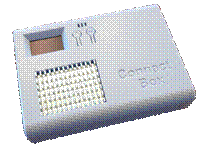<![endif]>    <!--[if gte vml 1]><v:shape
 id="Picture_x0020_219" o:spid="_x0000_i1073" type="#_x0000_t75" alt="A picture containing computer&#10;&#10;Description automatically generated"
 style='width:173.25pt;height:133.5pt;visibility:visible;mso-wrap-style:square'>
 <v:imagedata src="ConnectBox-GettingStarted_V7_files/image005.png" o:title="A picture containing computer&#10;&#10;Description automatically generated"/>
</v:shape><![endif]--><![if !vml]>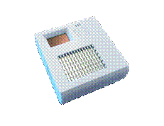<![endif]><o:p></o:p>

                                                                                                                Model
P V6                                                          Model  S V6<o:p></o:p>

                                                                   P/N 10001                                                            P/N
10002<o:p></o:p>

<o:p>&nbsp;</o:p>

                                                                                                                Model
P2 V7                                                        Model
S2 V7<o:p></o:p>

                                                                                                                P/N
10011                                                            P/N
10012<o:p></o:p>

<o:p>&nbsp;</o:p>

<h2>Overview and Initial Connection:</h2>

This ConnectBox is nearly ready to
go, just a few things that you need to do first to make the end user experience
useful.

Units shipped after May 1st,
2022 or units retrofitted with firmware version 2.0
will use this Document.  If your unit is
older or has <b>Version 1.X</b> firmware please refer to the <b>ConnectBox- Getting  Started_V6</b>
document.  If you would like to update to
the latest firmware you may do so by downloading and burning the firmware onto
a <!--[if gte vml 1]><v:shape id="Picture_x0020_223"
 o:spid="_x0000_i1072" type="#_x0000_t75" style='width:15.75pt;height:15.75pt;
 visibility:visible;mso-wrap-style:square'>
 <v:imagedata src="ConnectBox-GettingStarted_V7_files/image007.png" o:title=""/>
</v:shape><![endif]--><![if !vml]><![endif]> to <!--[if gte vml 1]><v:shape
 id="Picture_x0020_224" o:spid="_x0000_i1071" type="#_x0000_t75" style='width:15.75pt;
 height:15.75pt;visibility:visible;mso-wrap-style:square'>
 <v:imagedata src="ConnectBox-GettingStarted_V7_files/image009.png" o:title=""/>
</v:shape><![endif]--><![if !vml]><![endif]> speed uSD card.  It is important to ensure that the uSD card
you use is of good quality and has the proper speed markings.  The location to download the firmware is <a
href="https://Github.com/ConnectBox/connectbox-pi/releases">https://Github.com/ConnectBox/connectbox-pi/releases</a>
and you are looking for the latest NEO Connectbox image.  This can be burned on the uSD card using a
tool Balena Etcher on either a Windows machine or Macintosh machine or Linux
machine.  See the <b>ConnectBox Upgrading
your firmware for hardware version V1-V3</b> or <b>V4-V7</b> document on the
Connectbox.org website.

The platforms that are supported by
version 2.0 firmware with additional hardware are:

<a name="_Toc103598837">Nano Pi Neo</a>
– as shown in Model P, P2 and Model S, S2 above               <!--[if gte vml 1]><v:shape id="Picture_x0020_5"
 o:spid="_x0000_i1070" type="#_x0000_t75" alt="A close-up of a computer&#10;&#10;Description automatically generated with low confidence"
 style='width:137.25pt;height:120pt;visibility:visible;mso-wrap-style:square'>
 <v:imagedata src="ConnectBox-GettingStarted_V7_files/image011.jpg" o:title="A close-up of a computer&#10;&#10;Description automatically generated with low confidence"/>
</v:shape><![endif]--><![if !vml]>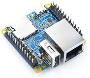<![endif]>

 

<o:p>&nbsp;</o:p>

<h2><a name="_Toc103598838">Raspberry Pi<b>:</b></a><b><o:p></o:p></b></h2>

Raspberry Pi Zero W:                                   Raspberry
Pi3b:                                  Raspberry Pi4b:

<!--[if gte vml 1]><v:shape
 id="Picture_x0020_9" o:spid="_x0000_i1069" type="#_x0000_t75" alt="A picture containing electronics, circuit&#10;&#10;Description automatically generated"
 style='width:126pt;height:83.25pt;visibility:visible;mso-wrap-style:square'>
 <v:imagedata src="ConnectBox-GettingStarted_V7_files/image013.jpg" o:title="A picture containing electronics, circuit&#10;&#10;Description automatically generated"/>
</v:shape><![endif]--><![if !vml]><![endif]>                <!--[if gte vml 1]><v:shape id="Picture_x0020_11"
 o:spid="_x0000_i1068" type="#_x0000_t75" alt="A picture containing electronics, circuit&#10;&#10;Description automatically generated"
 style='width:137.25pt;height:92.25pt;flip:x;visibility:visible;
 mso-wrap-style:square'>
 <v:imagedata src="ConnectBox-GettingStarted_V7_files/image015.jpg" o:title="A picture containing electronics, circuit&#10;&#10;Description automatically generated"/>
</v:shape><![endif]--><![if !vml]><![endif]>              <!--[if gte vml 1]><v:shape id="Picture_x0020_13"
 o:spid="_x0000_i1067" type="#_x0000_t75" alt="A picture containing electronics, circuit&#10;&#10;Description automatically generated"
 style='width:156pt;height:117pt;visibility:visible;mso-wrap-style:square'>
 <v:imagedata src="ConnectBox-GettingStarted_V7_files/image017.jpg" o:title="A picture containing electronics, circuit&#10;&#10;Description automatically generated"/>
</v:shape><![endif]--><![if !vml]><![endif]>

Raspberry Pi CM4:                                         \

<!--[if gte vml 1]><v:shape
 id="Picture_x0020_15" o:spid="_x0000_i1066" type="#_x0000_t75" alt="A picture containing text, electronics, circuit&#10;&#10;Description automatically generated"
 style='width:164.25pt;height:117pt;flip:x;visibility:visible;mso-wrap-style:square'>
 <v:imagedata src="ConnectBox-GettingStarted_V7_files/image019.jpg" o:title="A picture containing text, electronics, circuit&#10;&#10;Description automatically generated"/>
</v:shape><![endif]--><![if !vml]><![endif]>

Orange Pi:

Orange Pi Zero2:<b><o:p></o:p></b>

            <!--[if gte vml 1]><v:shape id="Picture_x0020_17"
 o:spid="_x0000_i1065" type="#_x0000_t75" alt="A close-up of a circuit board&#10;&#10;Description automatically generated with low confidence"
 style='width:210pt;height:114.75pt;visibility:visible;mso-wrap-style:square'>
 <v:imagedata src="ConnectBox-GettingStarted_V7_files/image021.jpg" o:title="A close-up of a circuit board&#10;&#10;Description automatically generated with low confidence"/>
</v:shape><![endif]--><![if !vml]>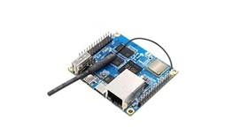<![endif]>

<o:p>&nbsp;</o:p>

<h2 style='margin-left:24.0pt'><a name="_Toc103598839">Differences between
Model P V6 and Model P2 V7 as well as Model S V6 and Model S2 V7</a></h2>

<h2 style='margin-left:0in'><o:p>&nbsp;</o:p></h2>

The
main difference between the Model P V6 and Model S V6 vs
the Model P2 V7 and Model S2 V7 is that there is an
additional Wi-Fi module incorporated internally for connection to the internet
via a Wi-Fi or via tethering to a mobile phone. 
Additionally, the Model P2 and Model S2 have OTG capability on the USB C
power port allowing you to connect it directly to a host computer for data
transfer or other client hardware.  Also,
we have upgraded the firmware from V1 – V2 allowing a more visually appealing
user experience.  We have also added
language detection of the client and support multilingual content based on ISO
code identified folders in the data section. 
We have added phone home capabilities to allow a central control server
to manage multiple Connectboxe’s in the field receiving statistical data on usage,
allowing control over all configuration features, and uploading of new content
to each unique Connectbox based on location.<o:p></o:p>

<o:p>&nbsp;</o:p>

Another
difference between a V6 hardware and V7 hardware is that V6 has a slide power
switch on the side where V7 has a push for 3 second turn on and push for 6 second
turn off mode on the 1st switch closest to the LCD display.  The V6 switch when
turned off will keep the power up on the unit for about 20 seconds before going
down to allow the system to save its state. 
However, when you switch a unit off it will immediately stop
transmission over the Wifi.<o:p></o:p>

<o:p>&nbsp;</o:p>

<o:p>&nbsp;</o:p>

Initial
Setup

<o:p>&nbsp;</o:p>

<![if !supportLists]>1.&nbsp;&nbsp;&nbsp;&nbsp;&nbsp; <![endif]>ConnectBox
comes with internal system software. No content is included other than a readme
file. You’ll need to add your own content to the device using the guidelines in
the sections below.<o:p></o:p>

<![if !supportLists]>2.&nbsp;&nbsp;&nbsp;&nbsp;&nbsp;
<![endif]>Your battery version ConnectBox comes with an internal lithium-ion
battery which is shipped at 30% charge level. To charge the battery, you’ll
need to connect it to a 1A or greater microUSB charger like are found with many
cell phones. For charging from an empty to full battery, expect it to take
around 4-7 hours. Your ConnectBox has built-in low battery protection which prevents
the battery from going into deep discharge as well as from overcharging.<o:p></o:p>

<o:p>&nbsp;</o:p>

PLEASE FULLY CHARGE YOUR CONNECTBOX
BEFORE THE FIRST USE<o:p></o:p>

<o:p>&nbsp;</o:p>

<!--[if gte vml 1]><v:shapetype id="_x0000_t202"
 coordsize="21600,21600" o:spt="202" path="m,l,21600r21600,l21600,xe">
 <v:stroke joinstyle="miter"/>
 <v:path gradientshapeok="t" o:connecttype="rect"/>
</v:shapetype><v:shape id="_x0000_s2099" type="#_x0000_t202" style='position:absolute;
 left:0;text-align:left;margin-left:250.95pt;margin-top:313.65pt;width:49.4pt;
 height:20.35pt;z-index:251665408;visibility:visible;mso-wrap-distance-top:3.6pt;
 mso-wrap-distance-bottom:3.6pt' filled="f" stroked="f">
 <v:textbox style='mso-next-textbox:#_x0000_s2099;mso-fit-shape-to-text:t'/>
</v:shape><![endif]--><![if !vml]>

<table cellpadding=0 cellspacing=0>
 <tr>
  <td width=69 height=31 style='vertical-align:top'><![endif]><![if !mso]>
  <table cellpadding=0 cellspacing=0 width="100%">
   <tr>
    <td><![endif]>
    

    
USB-C<o:p></o:p>

    

    <![if !mso]></td>
   </tr>
  </table>
  <![endif]><![if !mso & !vml]>&nbsp;<![endif]><![if !vml]></td>
 </tr>
</table>

<![endif]><!--[if gte vml 1]><v:shape id="_x0000_s2100" type="#_x0000_t202"
 style='position:absolute;left:0;text-align:left;margin-left:175.15pt;
 margin-top:264.25pt;width:49.4pt;height:20.35pt;z-index:251664384;
 visibility:visible;mso-wrap-distance-top:3.6pt;mso-wrap-distance-bottom:3.6pt'
 filled="f" stroked="f">
 <v:textbox style='mso-next-textbox:#_x0000_s2100;mso-fit-shape-to-text:t'/>
</v:shape><![endif]--><![if !vml]>

<table cellpadding=0 cellspacing=0>
 <tr>
  <td width=69 height=31 style='vertical-align:top'><![endif]><![if !mso]>
  <table cellpadding=0 cellspacing=0 width="100%">
   <tr>
    <td><![endif]>
    

    
USB-A<o:p></o:p>

    

    <![if !mso]></td>
   </tr>
  </table>
  <![endif]><![if !mso & !vml]>&nbsp;<![endif]><![if !vml]></td>
 </tr>
</table>

<![endif]><!--[if gte vml 1]><v:shape id="_x0000_s2098" type="#_x0000_t202"
 style='position:absolute;left:0;text-align:left;margin-left:94.5pt;
 margin-top:14.3pt;width:132.35pt;height:26.9pt;z-index:251663360;visibility:visible;
 mso-wrap-distance-top:3.6pt;mso-wrap-distance-bottom:3.6pt' filled="f"
 stroked="f">
 <v:textbox style='mso-fit-shape-to-text:t'/>
</v:shape><![endif]--><![if !vml]>

<table cellpadding=0 cellspacing=0>
 <tr>
  <td width=180 height=40 style='vertical-align:top'><![endif]><![if !mso]>
  <table cellpadding=0 cellspacing=0 width="100%">
   <tr>
    <td><![endif]>
    

    
<b>press for 3
    seconds to turn on<o:p></o:p></b>

    
<b>press for
    8-10 seconds to turn off<o:p></o:p></b>

    

    <![if !mso]></td>
   </tr>
  </table>
  <![endif]><![if !mso & !vml]>&nbsp;<![endif]><![if !vml]></td>
 </tr>
</table>

<![endif]><!--[if gte vml 1]><v:oval id="Oval_x0020_221" o:spid="_x0000_s2097"
 style='position:absolute;left:0;text-align:left;margin-left:219.3pt;
 margin-top:53.3pt;width:45.5pt;height:21.35pt;z-index:251657216;visibility:visible;
 v-text-anchor:middle' filled="f" strokecolor="red" strokeweight="2pt"/><![endif]--><![if !vml]><![endif]><!--[if gte vml 1]><v:shape
 id="Picture_x0020_220" o:spid="_x0000_i1064" type="#_x0000_t75" style='width:429pt;
 height:336.75pt;visibility:visible;mso-wrap-style:square'>
 <v:imagedata src="ConnectBox-GettingStarted_V7_files/image024.png" o:title=""/>
</v:shape><![endif]--><![if !vml]>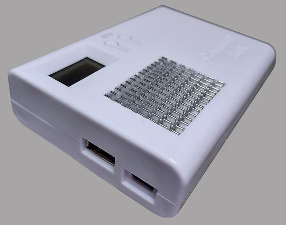<![endif]><o:p></o:p>

<o:p>&nbsp;</o:p>

<!--[if gte vml 1]><v:shape id="_x0000_s2102" type="#_x0000_t202"
 style='position:absolute;left:0;text-align:left;margin-left:208.2pt;
 margin-top:6.25pt;width:135.6pt;height:23.25pt;z-index:-251655168;
 visibility:visible;mso-wrap-distance-left:9pt;mso-wrap-distance-top:3.6pt;
 mso-wrap-distance-right:9pt;mso-wrap-distance-bottom:3.6pt;
 mso-position-horizontal-relative:text;mso-position-vertical-relative:text;
 mso-width-relative:margin;mso-height-relative:margin;v-text-anchor:top'
 stroked="f">
 <v:textbox style='mso-next-textbox:#_x0000_s2102'/>
</v:shape><![endif]--><![if !vml]>

<table cellpadding=0 cellspacing=0>
 <tr>
  <td width=184 height=35 bgcolor=white style='vertical-align:top;background:
  white'><![endif]><![if !mso]>
  <table cellpadding=0 cellspacing=0 width="100%">
   <tr>
    <td><![endif]>
    

    
Connectbox Model P2 V7

    

    <![if !mso]></td>
   </tr>
  </table>
  <![endif]><![if !mso & !vml]>&nbsp;<![endif]><![if !vml]></td>
 </tr>
</table>

<![endif]><o:p></o:p>

<o:p>&nbsp;</o:p>

<o:p>&nbsp;</o:p>

<![if !supportLists]>3.&nbsp;&nbsp;&nbsp;&nbsp;&nbsp;
<![endif]>With the microUSB charger plugged in or with a relatively full battery,
turn your unit on using the switch on the side of the unit. Allow a <b
style='mso-bidi-font-weight:normal'>minute</b> <b>or two</b> to pass before
using a wireless device to locate and
join the default wireless network with the default called <i style='mso-bidi-font-style:
normal'>ConnectBox - Free Media</i>.  You
will know when it is available by the <b>orange</b> LED turning on. (Note: that
if you charge your unit and run the unit
simultaneously in a hot climate it may cause a red flashing indicator of high
temperature internal to the unit.)  Units’
version 3 6 of the connectbox have an on/off switch.  Unit version 7 of the connectbox do not have
an on/off switch.  Instead hold the
&#708; up arrow key for 3 seconds to turn on and hold the &#708;up arrow key
for 8-10 seconds to turn the unit off.<o:p></o:p>

<o:p>&nbsp;</o:p>

<i style='mso-bidi-font-style:
normal'><o:p>&nbsp;</o:p></i>

<i style='mso-bidi-font-style:normal'> 
</i>

<i style='mso-bidi-font-style:normal'><o:p>&nbsp;</o:p></i>

<w:Sdt SdtDocPart="t" DocPartType="Table of Contents" DocPartUnique="t"
 ID="1984418315">
 
Contents<w:sdtPr></w:sdtPr>

 
<!--[if supportFields]> TOC \o &quot;1-3&quot; \h \z \u <![endif]--><a href="#_Toc103598836">Overview and Initial Connection: <!--[if supportFields]>
 PAGEREF _Toc103598836 \h <![endif]-->1<!--[if gte mso 9]><xml>
  <w:data>08D0C9EA79F9BACE118C8200AA004BA90B02000000080000000E0000005F0054006F0063003100300033003500390038003800330036000000</w:data>
 </xml><![endif]--><!--[if supportFields]><![endif]--></a><o:p></o:p>

 
<a
 href="#_Toc103598837">Nano Pi Neo. <!--[if supportFields]>
 PAGEREF _Toc103598837 \h <![endif]-->1<!--[if gte mso 9]><xml>
  <w:data>08D0C9EA79F9BACE118C8200AA004BA90B02000000080000000E0000005F0054006F0063003100300033003500390038003800330037000000</w:data>
 </xml><![endif]--><!--[if supportFields]><![endif]--></a><o:p></o:p>

 
<a
 href="#_Toc103598838">Raspberry Pi<b>:</b> <!--[if supportFields]>
 PAGEREF _Toc103598838 \h <![endif]-->2<!--[if gte mso 9]><xml>
  <w:data>08D0C9EA79F9BACE118C8200AA004BA90B02000000080000000E0000005F0054006F0063003100300033003500390038003800330038000000</w:data>
 </xml><![endif]--><!--[if supportFields]><![endif]--></a><o:p></o:p>

 
<a
 href="#_Toc103598839">Differences between Model
 P V6 and Model P2 V7 as well as Model S V6 and Model S2 V7. <!--[if supportFields]>
 PAGEREF _Toc103598839 \h <![endif]-->2<!--[if gte mso 9]><xml>
  <w:data>08D0C9EA79F9BACE118C8200AA004BA90B02000000080000000E0000005F0054006F0063003100300033003500390038003800330039000000</w:data>
 </xml><![endif]--><!--[if supportFields]><![endif]--></a><o:p></o:p>

 
    <a href="#_Toc103598840">Connecting to your Device: <!--[if supportFields]>
 PAGEREF _Toc103598840 \h <![endif]-->6<!--[if gte mso 9]><xml>
  <w:data>08D0C9EA79F9BACE118C8200AA004BA90B02000000080000000E0000005F0054006F0063003100300033003500390038003800340030000000</w:data>
 </xml><![endif]--><!--[if supportFields]><![endif]--></a><o:p></o:p>

 
    <a href="#_Toc103598841">Adding in Media Content: <!--[if supportFields]>
 PAGEREF _Toc103598841 \h <![endif]-->8<!--[if gte mso 9]><xml>
  <w:data>08D0C9EA79F9BACE118C8200AA004BA90B02000000080000000E0000005F0054006F0063003100300033003500390038003800340031000000</w:data>
 </xml><![endif]--><!--[if supportFields]><![endif]--></a><o:p></o:p>

 
    <a
 href="#_Toc103598842">Using the Chat
 functionality: <!--[if supportFields]>
 PAGEREF _Toc103598842 \h <![endif]-->12<!--[if gte mso 9]><xml>
  <w:data>08D0C9EA79F9BACE118C8200AA004BA90B02000000080000000E0000005F0054006F0063003100300033003500390038003800340032000000</w:data>
 </xml><![endif]--><!--[if supportFields]><![endif]--></a><o:p></o:p>

 
<a
 href="#_Toc103598843">LEDs and Screen Usage: <!--[if supportFields]>
 PAGEREF _Toc103598843 \h <![endif]-->15<!--[if gte mso 9]><xml>
  <w:data>08D0C9EA79F9BACE118C8200AA004BA90B02000000080000000E0000005F0054006F0063003100300033003500390038003800340033000000</w:data>
 </xml><![endif]--><!--[if supportFields]><![endif]--></a><o:p></o:p>

 
    <a
 href="#_Toc103598844">The Administrator
 Web Page: <!--[if supportFields]>
 PAGEREF _Toc103598844 \h <![endif]-->21<!--[if gte mso 9]><xml>
  <w:data>08D0C9EA79F9BACE118C8200AA004BA90B02000000080000000E0000005F0054006F0063003100300033003500390038003800340034000000</w:data>
 </xml><![endif]--><!--[if supportFields]><![endif]--></a><o:p></o:p>

 
<a
 href="#_Toc103598845">Configuring your unit <!--[if supportFields]>
 PAGEREF _Toc103598845 \h <![endif]-->21<!--[if gte mso 9]><xml>
  <w:data>08D0C9EA79F9BACE118C8200AA004BA90B02000000080000000E0000005F0054006F0063003100300033003500390038003800340035000000</w:data>
 </xml><![endif]--><!--[if supportFields]><![endif]--></a><o:p></o:p>

 
<a
 href="#_Toc103598846">Enabling SSH for the
 device: <!--[if supportFields]>
 PAGEREF _Toc103598846 \h <![endif]-->26<!--[if gte mso 9]><xml>
  <w:data>08D0C9EA79F9BACE118C8200AA004BA90B02000000080000000E0000005F0054006F0063003100300033003500390038003800340036000000</w:data>
 </xml><![endif]--><!--[if supportFields]><![endif]--></a><o:p></o:p>

 
<a
 href="#_Toc103598847">Upgrading the firmware
 with interim patches. <!--[if supportFields]>
 PAGEREF _Toc103598847 \h <![endif]-->26<!--[if gte mso 9]><xml>
  <w:data>08D0C9EA79F9BACE118C8200AA004BA90B02000000080000000E0000005F0054006F0063003100300033003500390038003800340037000000</w:data>
 </xml><![endif]--><!--[if supportFields]><![endif]--></a><o:p></o:p>

 
<a
 href="#_Toc103598848">Enabling Custom Web
 Interface. <!--[if supportFields]>
 PAGEREF _Toc103598848 \h <![endif]-->27<!--[if gte mso 9]><xml>
  <w:data>08D0C9EA79F9BACE118C8200AA004BA90B02000000080000000E0000005F0054006F0063003100300033003500390038003800340038000000</w:data>
 </xml><![endif]--><!--[if supportFields]><![endif]--></a><o:p></o:p>

 
<a
 href="#_Toc103598849">Enabling Custom WordPress
 installation. <!--[if supportFields]>
 PAGEREF _Toc103598849 \h <![endif]-->27<!--[if gte mso 9]><xml>
  <w:data>08D0C9EA79F9BACE118C8200AA004BA90B02000000080000000E0000005F0054006F0063003100300033003500390038003800340039000000</w:data>
 </xml><![endif]--><!--[if supportFields]><![endif]--></a><o:p></o:p>

 
<a
 href="#_Toc103598850">Linking your Connectbox
 to Control Host <!--[if supportFields]>
 PAGEREF _Toc103598850 \h <![endif]-->27<!--[if gte mso 9]><xml>
  <w:data>08D0C9EA79F9BACE118C8200AA004BA90B02000000080000000E0000005F0054006F0063003100300033003500390038003800350030000000</w:data>
 </xml><![endif]--><!--[if supportFields]><![endif]--></a><o:p></o:p>

 
<a
 href="#_Toc103598851">Features: <!--[if supportFields]>
 PAGEREF _Toc103598851 \h <![endif]-->30<!--[if gte mso 9]><xml>
  <w:data>08D0C9EA79F9BACE118C8200AA004BA90B02000000080000000E0000005F0054006F0063003100300033003500390038003800350031000000</w:data>
 </xml><![endif]--><!--[if supportFields]><![endif]--></a><o:p></o:p>

 
<!--[if supportFields]><b></b><![endif]--><o:p>&nbsp;</o:p>

</w:Sdt><i style='mso-bidi-font-style:normal'> 
</i>

<i style='mso-bidi-font-style:normal'><o:p>&nbsp;</o:p></i>

<i style='mso-bidi-font-style:normal'><o:p>&nbsp;</o:p></i>

<h1 style='margin-left:22.5pt'><a name="_Toc103598840">Connecting
to your Device</a>:</h1>

<o:p>&nbsp;</o:p>

After the unit is on and you see
the <b>Orange</b> LED indicating that the Wi-Fi hotspot is transmitting, using
your mobile phone, or tablet/laptop open the Wi-Fi settings menus and look for <b>Connectbox
– Free Wifi !  </b>Select that
Wi-Fi connection and your device will connect and then direct you to the
captive portal to validate connectivity to the Connectbox device or
check if a login is required for the network join’. In this case it will show a
web browser window that say’s to connect to <a href="http://gowifi.org">http://gowifi.org</a>.  In some cases you may need to go to the
‘more’ menu (sometimes three vertical dots  ( &#8285; ) and ‘keep the connection’.  On the captive portal page, you will be asked
to enter<a href="%20http:/gowifi%20"> http://gowifi </a>in the URL window. This
should open the default front page of the Connectbox.  (Note: on some Samsung Galaxy phones or newer
mobile phones you may be directed to turn off your cellular data for the Wi-Fi
to fully work. <a href="http://gowifi.org">http://gowifi.org</a> will tell you if you
need to do so.  If so, turn off your cellular
data connection as your phone will default to using that for internet rather
than the connectbox.  Once you turn off
data, pull down on the screen and it will refresh returning you to <a
href="http://connectbox.org">http://connectbox.org</a>
or the appropriate hostname of the device.<o:p></o:p>

<o:p>&nbsp;</o:p>

<o:p>&nbsp;</o:p>

<!--[if gte vml 1]><v:shape
 id="Picture_x0020_33" o:spid="_x0000_i1063" type="#_x0000_t75" alt="A screenshot of a cell phone&#10;&#10;Description automatically generated"
 style='width:111pt;height:228pt;visibility:visible;mso-wrap-style:square'>
 <v:imagedata src="ConnectBox-GettingStarted_V7_files/image026.jpg" o:title="A screenshot of a cell phone&#10;&#10;Description automatically generated"/>
</v:shape><![endif]--><![if !vml]><![endif]> 
<!--[if gte vml 1]><v:shape id="Picture_x0020_34"
 o:spid="_x0000_i1062" type="#_x0000_t75" alt="A screenshot of a cell phone&#10;&#10;Description automatically generated"
 style='width:111pt;height:227.25pt;visibility:visible;mso-wrap-style:square'>
 <v:imagedata src="ConnectBox-GettingStarted_V7_files/image028.jpg" o:title="A screenshot of a cell phone&#10;&#10;Description automatically generated"/>
</v:shape><![endif]--><![if !vml]><![endif]>  <!--[if gte vml 1]><v:shape
 id="Picture_x0020_35" o:spid="_x0000_i1061" type="#_x0000_t75" alt="A screenshot of a cell phone&#10;&#10;Description automatically generated"
 style='width:111pt;height:228.75pt;visibility:visible;mso-wrap-style:square'>
 <v:imagedata src="ConnectBox-GettingStarted_V7_files/image030.jpg" o:title="A screenshot of a cell phone&#10;&#10;Description automatically generated"/>
</v:shape><![endif]--><![if !vml]><![endif]>  <!--[if gte vml 1]><v:shape
 id="Picture_x0020_36" o:spid="_x0000_i1060" type="#_x0000_t75" style='width:111pt;
 height:228pt;visibility:visible;mso-wrap-style:square'>
 <v:imagedata src="ConnectBox-GettingStarted_V7_files/image032.jpg" o:title=""/>
</v:shape><![endif]--><![if !vml]><![endif]>

<o:p>&nbsp;</o:p>

When you’re ready click OK. or use the <u>highlighted</u> hot web link on the top of the
phone image to connect you to the ConnectBox. 
This is needed to make the connection and then you will be redirected
back to the Wi-Fi connection page.  If not,
please close this browser.  Once
connected, you will need to open up a browser on your
device (native browser, chrome, safari, Firefox, etc.)  and type in the web address of <a
href="http://gowifi.org">http://gowifi.org</a> which will then result in seeing
the main ConnectBox window, or again if the cellular data is an issue will
instruct you to turn that off.  It will
show a blank screen as:

<o:p>&nbsp;</o:p>

<o:p>&nbsp;</o:p>

<o:p>&nbsp;</o:p>

<i style='mso-bidi-font-style:
normal'>                                                   
<!--[if gte vml 1]><v:shape id="Picture_x0020_16"
 o:spid="_x0000_i1059" type="#_x0000_t75" style='width:131.25pt;height:269.25pt;
 visibility:visible;mso-wrap-style:square'>
 <v:imagedata src="ConnectBox-GettingStarted_V7_files/image034.jpg" o:title=""/>
</v:shape><![endif]--><![if !vml]><![endif]><o:p></o:p></i>

<i style='mso-bidi-font-style:normal'><o:p>&nbsp;</o:p></i>

Although the default settings for the ConnectBox make it
usable without any changes, data needs to be added for the users to view.  Additionally, the Configuration options
(discussed below) are available for those who wish to customize the operation
of the ConnectBox.

 

<h1 style='margin-left:0in'>Adding in Media Content:</h1>

You have the option of connecting
an external USB stick to the USB A port that is available on the ConnectBox’s
exterior. The USB A port will in a sense override any content that is stored on
the microSD card within the unit. The USB stick should be formatted for EXT4,
FAT32 or NTFS format.  We recommend a
slim line USB media stick like the SanDisk Ultra Fit line for low profile and
USB 3 speed is recommended for faster system operation.   Disc capacities from 4 GB up to 512GB can be
used.  Media content can be added to it
using a Windows or Mac system.  Folders
can be used at your choosing and the file naming conventions can utilize the
full character set of UTF-8, meaning non-roman scripts can be used.

<o:p>&nbsp;</o:p>

The unit will default to an enhanced user interface.  This interface creates thumbnails of media
content at the root level/content folder and icons of folders for specific
media contents.  The icons look like
this: <o:p></o:p>

<o:p>&nbsp;</o:p>

<!--[if gte vml 1]><v:shape id="Picture_x0020_41"
 o:spid="_x0000_i1058" type="#_x0000_t75" alt="Graphical user interface, application&#10;&#10;Description automatically generated"
 style='width:384.75pt;height:288.75pt;visibility:visible;mso-wrap-style:square'>
 <v:imagedata src="ConnectBox-GettingStarted_V7_files/image036.png" o:title="Graphical user interface, application&#10;&#10;Description automatically generated"/>
</v:shape><![endif]--><![if !vml]>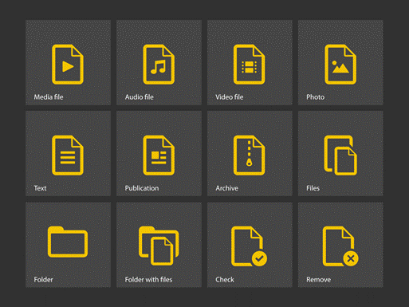<![endif]><o:p></o:p>

<o:p>&nbsp;</o:p>

Additionally for language
support, create a folder at the content level with the ISO code of that
language according to the ISO 639-2 which consists of 2 characters or 3 characters
representing the language code.  When a
folder at the content level has a language code it will be hidden from the default
language and listed in the language listing of the device.  When a user with a mobile
phone/tablet/computer connects to the connectbox with that language set by
default in the operating system it will automatically load that language folder
page as the root display.  Users can
always select the language they would like from the drop-down language listing:<o:p></o:p>

<!--[if gte vml 1]><v:shape
 id="Picture_x0020_45" o:spid="_x0000_i1057" type="#_x0000_t75" alt="Graphical user interface, application&#10;&#10;Description automatically generated"
 style='width:158.25pt;height:325.5pt;visibility:visible;mso-wrap-style:square'>
 <v:imagedata src="ConnectBox-GettingStarted_V7_files/image038.jpg" o:title="Graphical user interface, application&#10;&#10;Description automatically generated"/>
</v:shape><![endif]--><![if !vml]>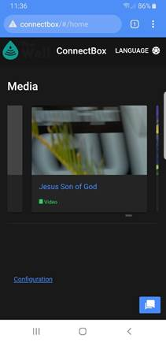<![endif]>  <!--[if gte vml 1]><v:shape
 id="Picture_x0020_46" o:spid="_x0000_i1056" type="#_x0000_t75" style='width:157.5pt;
 height:324pt;visibility:visible;mso-wrap-style:square'>
 <v:imagedata src="ConnectBox-GettingStarted_V7_files/image040.png" o:title=""/>
</v:shape><![endif]--><![if !vml]>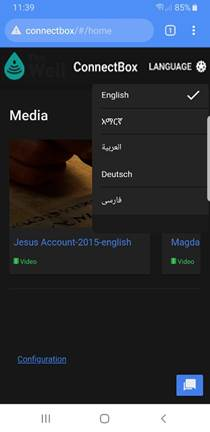<![endif]>  <!--[if gte vml 1]><v:shape id="Picture_x0020_47"
 o:spid="_x0000_i1055" type="#_x0000_t75" style='width:156.75pt;height:321.75pt;
 visibility:visible;mso-wrap-style:square'>
 <v:imagedata src="ConnectBox-GettingStarted_V7_files/image042.png" o:title=""/>
</v:shape><![endif]--><![if !vml]>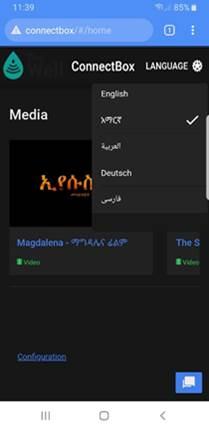<![endif]><o:p></o:p>

This example
would hae a folders labeled:<o:p></o:p>

                                    root
directory: &#9472;content<o:p></o:p>

                                                                   
&#9500;&#9472;&#9472;  en<o:p></o:p>

                                                                    &#9500;&#9472;&#9472;  am <o:p></o:p>

                                                                    &#9500;&#9472;&#9472;  ar<o:p></o:p>

                                                                    &#9500;&#9472;&#9472;  de<o:p></o:p>

                                                                    &#9492;&#9472;&#9472;  fa<o:p></o:p>

Folders at
the content directory that do not contain valid ISO language codes will be
ignored.  There also should be no media
at the content level if language folders are used as it will be ignored.<o:p></o:p>

<o:p>&nbsp;</o:p>

If no
language folders are used then the entire contents of the USB flash drive will
be considered without a selectable  language. 
Any folders at the content level will be displayed using the default
icons above with the appropriate media contents listed and any media in the content
folder will be displayed as appropriate.<o:p></o:p>

<o:p>&nbsp;</o:p>

Note: media
that is at the root level or other files at the root level are ignored by the
ConnectBox unless specifically used for administrative purposes.  See Enableing SSH and Upgrading firmware for
these cases..<o:p></o:p>

<o:p>&nbsp;</o:p>

Media
contents are scrolled starting from right to left meaning swiping left on your
phone screen will reveal additional media if available.  Media that is a collection of contents will
be supported under a file structure. 
When you enter that structure it will list the other items
available.  This includes audio files
that are sequenced in episodes for sequential listening, chapters of books,
etc.  Within a media folder multiple
types of media can exsist.  This means
you can have video content along with study guides, and audio contnet.<o:p></o:p>

<o:p>&nbsp;</o:p>

Media type
supported are: mp4, pdf, png, jpeg, mp3 apng, avif, gif, svg+xml, webp, webm,
ogg, etc.  See the detailed support
documentation on browsers to get an understanding of the containers vs the
codecs used in different media types.<o:p></o:p>

<!--[if gte vml 1]><v:shape
 id="Picture_x0020_48" o:spid="_x0000_i1054" type="#_x0000_t75" alt="Graphical user interface, application&#10;&#10;Description automatically generated"
 style='width:184.5pt;height:378.75pt;visibility:visible;mso-wrap-style:square'>
 <v:imagedata src="ConnectBox-GettingStarted_V7_files/image044.jpg" o:title="Graphical user interface, application&#10;&#10;Description automatically generated"/>
</v:shape><![endif]--><![if !vml]>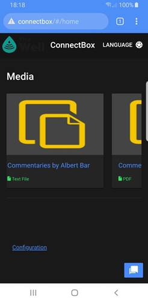<![endif]>  <!--[if gte vml 1]><v:shape
 id="Picture_x0020_49" o:spid="_x0000_i1053" type="#_x0000_t75" alt="Graphical user interface, application&#10;&#10;Description automatically generated"
 style='width:183.75pt;height:377.25pt;visibility:visible;mso-wrap-style:square'>
 <v:imagedata src="ConnectBox-GettingStarted_V7_files/image046.jpg" o:title="Graphical user interface, application&#10;&#10;Description automatically generated"/>
</v:shape><![endif]--><![if !vml]>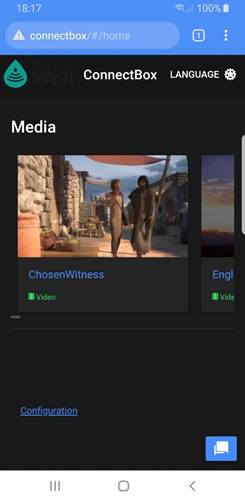<![endif]><o:p></o:p>

 

<o:p>&nbsp;</o:p>

For elements
of a collection:<o:p></o:p>

<o:p>&nbsp;</o:p>

Selection of
the folder then provides a view of the content scroling up, showing the
different types of content and either a view button or a download button.  Selecting the view button will either show
the media and allow you to interact with it or, you can select the download
button to store it on your current device to look at later.  Note that in this exaple there is a zip file
of the Commentaries by Charles Haddon Spurgeon as the first item in the folder.  Where the second item is a pdf file that can
be opened with the built in pdf reader or downloaded.<o:p></o:p>

<o:p>&nbsp;</o:p>

<!--[if gte vml 1]><v:shape
 id="Picture_x0020_52" o:spid="_x0000_i1052" type="#_x0000_t75" style='width:138pt;
 height:283.5pt;visibility:visible;mso-wrap-style:square'>
 <v:imagedata src="ConnectBox-GettingStarted_V7_files/image048.jpg" o:title=""/>
</v:shape><![endif]--><![if !vml]><![endif]>    <!--[if gte vml 1]><v:shape id="Picture_x0020_53"
 o:spid="_x0000_i1051" type="#_x0000_t75" alt="A picture containing icon&#10;&#10;Description automatically generated"
 style='width:138pt;height:283.5pt;visibility:visible;mso-wrap-style:square'>
 <v:imagedata src="ConnectBox-GettingStarted_V7_files/image050.jpg" o:title="A picture containing icon&#10;&#10;Description automatically generated"/>
</v:shape><![endif]--><![if !vml]><![endif]>    <!--[if gte vml 1]><v:shape id="Picture_x0020_54"
 o:spid="_x0000_i1050" type="#_x0000_t75" alt="Graphical user interface, application, Teams&#10;&#10;Description automatically generated"
 style='width:138pt;height:283.5pt;visibility:visible;mso-wrap-style:square'>
 <v:imagedata src="ConnectBox-GettingStarted_V7_files/image052.jpg" o:title="Graphical user interface, application, Teams&#10;&#10;Description automatically generated"/>
</v:shape><![endif]--><![if !vml]><![endif]> 

<!--[if gte vml 1]><v:shape
 id="Picture_x0020_55" o:spid="_x0000_i1049" type="#_x0000_t75" alt="Graphical user interface, application, PowerPoint&#10;&#10;Description automatically generated"
 style='width:138pt;height:283.5pt;visibility:visible;mso-wrap-style:square'>
 <v:imagedata src="ConnectBox-GettingStarted_V7_files/image054.jpg" o:title="Graphical user interface, application, PowerPoint&#10;&#10;Description automatically generated"/>
</v:shape><![endif]--><![if !vml]><![endif]>  <!--[if gte vml 1]><v:shape id="Picture_x0020_57"
 o:spid="_x0000_i1048" type="#_x0000_t75" alt="Graphical user interface, text, application, chat or text message&#10;&#10;Description automatically generated"
 style='width:138pt;height:283.5pt;visibility:visible;mso-wrap-style:square'>
 <v:imagedata src="ConnectBox-GettingStarted_V7_files/image056.jpg" o:title="Graphical user interface, text, application, chat or text message&#10;&#10;Description automatically generated"/>
</v:shape><![endif]--><![if !vml]><![endif]>   

To move backwards from your
current location either cancel, or use the upper left
back arrow (sometimes you will find an upper right X to press to stop the media
player then use the upper left back arrow. 
Additionally, you can always use the devise back arrow button on the
bottom or swipe back in some cases.  In
the case the file contains HTML media and an index.html file exists it will
open in your browser that media directly.  
Navigation in this case is dependent on the application and you can
always go back to starting screen by typing in the browser address bar http://connectbox
or whatever the name of your connected system is.  If all else fails type http://gowifi.org in
the address bar.

 

<o:p>&nbsp;</o:p>

<h1>Using the Chat functionality:</h1>

<o:p>&nbsp;</o:p>

Built into the main function of the Connectbox is the
ability for users connected to the box to converse with one another.  This is entered by tapping the chat icon on
the bottom right of the screen:

<!--[if gte vml 1]><v:shape id="Text_x0020_Box_x0020_2"
 o:spid="_x0000_s2051" type="#_x0000_t202" style='position:absolute;
 margin-left:331.4pt;margin-top:257.05pt;width:115.8pt;height:20.35pt;
 z-index:251656192;visibility:visible;mso-height-percent:200;
 mso-wrap-distance-top:3.6pt;mso-wrap-distance-bottom:3.6pt;
 mso-height-percent:200;mso-width-relative:margin;mso-height-relative:margin'
 o:gfxdata="UEsDBBQABgAIAAAAIQC2gziS/gAAAOEBAAATAAAAW0NvbnRlbnRfVHlwZXNdLnhtbJSRQU7DMBBF
90jcwfIWJU67QAgl6YK0S0CoHGBkTxKLZGx5TGhvj5O2G0SRWNoz/78nu9wcxkFMGNg6quQqL6RA
0s5Y6ir5vt9lD1JwBDIwOMJKHpHlpr69KfdHjyxSmriSfYz+USnWPY7AufNIadK6MEJMx9ApD/oD
OlTrorhX2lFEilmcO2RdNtjC5xDF9pCuTyYBB5bi6bQ4syoJ3g9WQ0ymaiLzg5KdCXlKLjvcW893
SUOqXwnz5DrgnHtJTxOsQfEKIT7DmDSUCaxw7Rqn8787ZsmRM9e2VmPeBN4uqYvTtW7jvijg9N/y
JsXecLq0q+WD6m8AAAD//wMAUEsDBBQABgAIAAAAIQA4/SH/1gAAAJQBAAALAAAAX3JlbHMvLnJl
bHOkkMFqwzAMhu+DvYPRfXGawxijTi+j0GvpHsDYimMaW0Yy2fr2M4PBMnrbUb/Q94l/f/hMi1qR
JVI2sOt6UJgd+ZiDgffL8ekFlFSbvV0oo4EbChzGx4f9GRdb25HMsYhqlCwG5lrLq9biZkxWOiqY
22YiTra2kYMu1l1tQD30/bPm3wwYN0x18gb45AdQl1tp5j/sFB2T0FQ7R0nTNEV3j6o9feQzro1i
OWA14Fm+Q8a1a8+Bvu/d/dMb2JY5uiPbhG/ktn4cqGU/er3pcvwCAAD//wMAUEsDBBQABgAIAAAA
IQCe6yHQ8gEAAMoDAAAOAAAAZHJzL2Uyb0RvYy54bWysU9uO0zAQfUfiHyy/07RV2l2ipqulqyKk
5SItfIDjOImF4zFjt8ny9YydtlvgDZEHy5Oxz8w5c7y5G3vDjgq9BlvyxWzOmbISam3bkn/7un9z
y5kPwtbCgFUlf1ae321fv9oMrlBL6MDUChmBWF8MruRdCK7IMi871Qs/A6csJRvAXgQKsc1qFAOh
9yZbzufrbACsHYJU3tPfhynJtwm/aZQMn5vGq8BMyam3kFZMaxXXbLsRRYvCdVqe2hD/0EUvtKWi
F6gHEQQ7oP4LqtcSwUMTZhL6DJpGS5U4EJvF/A82T51wKnEhcby7yOT/H6z8dHxyX5CF8R2MNMBE
wrtHkN89s7DrhG3VPSIMnRI1FV5EybLB+eJ0NUrtCx9BquEj1DRkcQiQgMYG+6gK8WSETgN4voiu
xsBkLJnfzNdrSknKLVe3eb5KJURxvu3Qh/cKehY3JUcaakIXx0cfYjeiOB+JxTwYXe+1MSnAttoZ
ZEdBBtin74T+2zFj42EL8dqEGP8kmpHZxDGM1UjJSLeC+pkII0yGogdAmw7wJ2cDmank/sdBoOLM
fLAk2ttFnkf3pSBf3SwpwOtMdZ0RVhJUyQNn03YXJsceHOq2o0rnMd2T0HudNHjp6tQ3GSZJczJ3
dOR1nE69PMHtLwAAAP//AwBQSwMEFAAGAAgAAAAhAPeAfgffAAAACQEAAA8AAABkcnMvZG93bnJl
di54bWxMj8FOwzAMhu9IvENkJG4sHeraUupOExMXDkgMJDhmTdpUNE6UZF15e8KJnSzLn35/f7Nd
zMRm5cNoCWG9yoAp6qwcaUD4eH++q4CFKEiKyZJC+FEBtu31VSNqac/0puZDHFgKoVALBB2jqzkP
nVZGhJV1itKtt96ImFY/cOnFOYWbid9nWcGNGCl90MKpJ62678PJIHwaPcq9f/3q5TTvX/rdxi3e
Id7eLLtHYFEt8R+GP/2kDm1yOtoTycAmhCIv1glF2ORpJqAqyxLYEeEhr4C3Db9s0P4CAAD//wMA
UEsBAi0AFAAGAAgAAAAhALaDOJL+AAAA4QEAABMAAAAAAAAAAAAAAAAAAAAAAFtDb250ZW50X1R5
cGVzXS54bWxQSwECLQAUAAYACAAAACEAOP0h/9YAAACUAQAACwAAAAAAAAAAAAAAAAAvAQAAX3Jl
bHMvLnJlbHNQSwECLQAUAAYACAAAACEAnush0PIBAADKAwAADgAAAAAAAAAAAAAAAAAuAgAAZHJz
L2Uyb0RvYy54bWxQSwECLQAUAAYACAAAACEA94B+B98AAAAJAQAADwAAAAAAAAAAAAAAAABMBAAA
ZHJzL2Rvd25yZXYueG1sUEsFBgAAAAAEAAQA8wAAAFgFAAAAAA==
" stroked="f">
 <v:textbox style='mso-fit-shape-to-text:t'>
  <![if !mso]>
  <table cellpadding=0 cellspacing=0 width="100%">
   <tr>
    <td><![endif]>
    

    
Tapping the Chat Icon

    

    <![if !mso]></td>
   </tr>
  </table>
  <![endif]></v:textbox>
 <w:wrap type="square"/>
</v:shape><![endif]--><![if !vml]><![endif]>

<!--[if gte vml 1]><v:oval id="Oval_x0020_53" o:spid="_x0000_s2050"
 style='position:absolute;margin-left:283.35pt;margin-top:241.45pt;width:33.75pt;
 height:30pt;z-index:251655168;visibility:visible' o:gfxdata="UEsDBBQABgAIAAAAIQC2gziS/gAAAOEBAAATAAAAW0NvbnRlbnRfVHlwZXNdLnhtbJSRQU7DMBBF
90jcwfIWJU67QAgl6YK0S0CoHGBkTxKLZGx5TGhvj5O2G0SRWNoz/78nu9wcxkFMGNg6quQqL6RA
0s5Y6ir5vt9lD1JwBDIwOMJKHpHlpr69KfdHjyxSmriSfYz+USnWPY7AufNIadK6MEJMx9ApD/oD
OlTrorhX2lFEilmcO2RdNtjC5xDF9pCuTyYBB5bi6bQ4syoJ3g9WQ0ymaiLzg5KdCXlKLjvcW893
SUOqXwnz5DrgnHtJTxOsQfEKIT7DmDSUCaxw7Rqn8787ZsmRM9e2VmPeBN4uqYvTtW7jvijg9N/y
JsXecLq0q+WD6m8AAAD//wMAUEsDBBQABgAIAAAAIQA4/SH/1gAAAJQBAAALAAAAX3JlbHMvLnJl
bHOkkMFqwzAMhu+DvYPRfXGawxijTi+j0GvpHsDYimMaW0Yy2fr2M4PBMnrbUb/Q94l/f/hMi1qR
JVI2sOt6UJgd+ZiDgffL8ekFlFSbvV0oo4EbChzGx4f9GRdb25HMsYhqlCwG5lrLq9biZkxWOiqY
22YiTra2kYMu1l1tQD30/bPm3wwYN0x18gb45AdQl1tp5j/sFB2T0FQ7R0nTNEV3j6o9feQzro1i
OWA14Fm+Q8a1a8+Bvu/d/dMb2JY5uiPbhG/ktn4cqGU/er3pcvwCAAD//wMAUEsDBBQABgAIAAAA
IQBBiL79/wEAAOIDAAAOAAAAZHJzL2Uyb0RvYy54bWysU9uO0zAQfUfiHyy/0zSlXbpR09WqSxHS
cpEWPmDqOI2F4zFjt+ny9Yzdy1bwhnix5mKfmTlzvLg79FbsNQWDrpblaCyFdgob47a1/P5t/WYu
RYjgGrDodC2fdZB3y9evFoOv9AQ7tI0mwSAuVIOvZRejr4oiqE73EEboteNki9RDZJe2RUMwMHpv
i8l4fFMMSI0nVDoEjj4ck3KZ8dtWq/ilbYOOwtaSe4v5pHxu0lksF1BtCXxn1KkN+IcuejCOi16g
HiCC2JH5C6o3ijBgG0cK+wLb1iidZ+BpyvEf0zx14HWehckJ/kJT+H+w6vP+yX+l1Hrwj6h+BOFw
1YHb6nsiHDoNDZcrE1HF4EN1eZCcwE/FZviEDa8WdhEzB4eW+gTI04lDpvr5QrU+RKE4OJ3MbyYz
KRSn3s7L8TivooDq/NhTiB809iIZtdTWGh8SGVDB/jHE1A9U51sp7HBtrM0LtU4MtbydcYU8GVrT
pGR2aLtZWRJ7YEms11z5XDpcXyPcuSaDJQren+wIxh5tLm7diZNEQ1JcqDbYPDMlhEeh8cdgo0P6
JcXAIqtl+LkD0lLYj45pvS2n06TK7Exn7ybs0HVmc50BpxiqllGKo7mKRyXvPJltx5XKPK7De15F
azJHL12dmmUhZepOok9KvfbzrZevufwNAAD//wMAUEsDBBQABgAIAAAAIQD/axxZ4AAAAAoBAAAP
AAAAZHJzL2Rvd25yZXYueG1sTI9NS8NAEIbvgv9hGcGLtLupptWYTRGxUgTBtva+zY7Jkv0I2W0b
/73jSY8z8/DO85bL0Vl2wiGa4CVkUwEMfR208Y2Ez91qcg8sJuW1ssGjhG+MsKwuL0pV6HD2Gzxt
U8MoxMdCSWhT6gvOY92iU3EaevR0+wqDU4nGoeF6UGcKd5bPhJhzp4ynD63q8bnFutsenYSb/fvH
SxdXa2G6xWBx8/pm9jMpr6/Gp0dgCcf0B8OvPqlDRU6HcPQ6MishX2Q5oRLu8gwYAfPbByp3IFLQ
hlcl/1+h+gEAAP//AwBQSwECLQAUAAYACAAAACEAtoM4kv4AAADhAQAAEwAAAAAAAAAAAAAAAAAA
AAAAW0NvbnRlbnRfVHlwZXNdLnhtbFBLAQItABQABgAIAAAAIQA4/SH/1gAAAJQBAAALAAAAAAAA
AAAAAAAAAC8BAABfcmVscy8ucmVsc1BLAQItABQABgAIAAAAIQBBiL79/wEAAOIDAAAOAAAAAAAA
AAAAAAAAAC4CAABkcnMvZTJvRG9jLnhtbFBLAQItABQABgAIAAAAIQD/axxZ4AAAAAoBAAAPAAAA
AAAAAAAAAAAAAFkEAABkcnMvZG93bnJldi54bWxQSwUGAAAAAAQABADzAAAAZgUAAAAA
" filled="f" strokecolor="red"/><![endif]--><![if !vml]><![endif]>                                                               <!--[if gte vml 1]><v:shape id="Picture_x0020_29"
 o:spid="_x0000_i1047" type="#_x0000_t75" style='width:138.75pt;height:285pt;
 visibility:visible;mso-wrap-style:square'>
 <v:imagedata src="ConnectBox-GettingStarted_V7_files/image060.jpg" o:title=""/>
</v:shape><![endif]--><![if !vml]><![endif]>

<o:p>&nbsp;</o:p>

 

<o:p>&nbsp;</o:p>

<o:p>&nbsp;</o:p>

This opens the chat window:

                                                              
<!--[if gte vml 1]><v:shape id="Picture_x0020_30"
 o:spid="_x0000_i1046" type="#_x0000_t75" style='width:138pt;height:283.5pt;
 visibility:visible;mso-wrap-style:square'>
 <v:imagedata src="ConnectBox-GettingStarted_V7_files/image062.jpg" o:title=""/>
</v:shape><![endif]--><![if !vml]><![endif]>

<o:p>&nbsp;</o:p>

Note that your name is automatically generated and is random
on the bottom left input bar.  You  can change the
‘name’ of the user in the bottom left panel and enter the text of the message
in the bottom right panel.  Once entered
it is posted by pressing the right airplane button on the bottom right the
message is posted in a group chat.

<o:p>&nbsp;</o:p>

                                                                  <!--[if gte vml 1]><v:shape id="Picture_x0020_31"
 o:spid="_x0000_i1045" type="#_x0000_t75" style='width:138.75pt;height:285.75pt;
 visibility:visible;mso-wrap-style:square'>
 <v:imagedata src="ConnectBox-GettingStarted_V7_files/image064.jpg" o:title=""/>
</v:shape><![endif]--><![if !vml]><![endif]>

<o:p>&nbsp;</o:p>

All users can see all messages that have been posted.  

<o:p>&nbsp;</o:p>

                                                                 
<!--[if gte vml 1]><v:shape id="Picture_x0020_192"
 o:spid="_x0000_i1044" type="#_x0000_t75" style='width:138.75pt;height:279pt;
 visibility:visible;mso-wrap-style:square'>
 <v:imagedata src="ConnectBox-GettingStarted_V7_files/image066.png" o:title=""/>
</v:shape><![endif]--><![if !vml]><![endif]>

<o:p>&nbsp;</o:p>

To exit the chat function simply press the back arrow ß
on the top right of the screen. 

<o:p>&nbsp;</o:p>

<o:p>&nbsp;</o:p>

<o:p>&nbsp;</o:p>

<h2><a name="_Toc103598843">LEDs and Screen Usage:</a></h2>

<o:p>&nbsp;</o:p>

 <o:p></o:p>

                                            <!--[if gte vml 1]><v:shape id="Picture_x0020_2"
 o:spid="_x0000_i1043" type="#_x0000_t75" style='width:222.75pt;height:167.25pt;
 visibility:visible;mso-wrap-style:square'>
 <v:imagedata src="ConnectBox-GettingStarted_V7_files/image068.jpg" o:title=""/>
</v:shape><![endif]--><![if !vml]>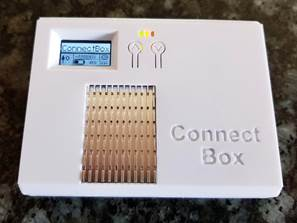<![endif]><o:p></o:p>

<o:p>&nbsp;</o:p>

On
the top front are three LED’s as well as one display and two buttons.  The Green LED indicates that the power is
turned on.  The Orange LED indicates that
the system is booted Wi-Fi signal is transmitting.  The Red LED is lit during battery charging
and will be extinguished when the battery if fully charged. Additionally, the
RED LED may blink to indicate a slow charge is occurring with the battery when
the unit is charging or turned on, additionally, it may blink if the charging
circuit is overheating.<o:p></o:p>

<o:p>&nbsp;</o:p>

(<b>NOTE:</b>
all screens can be controlled by the local system administrator and enabled or
disabled.  Your experience and screen
movement may vary from this guide due to screens being turned off.)<o:p></o:p>

<o:p>&nbsp;</o:p>

The
OLED screen on power up will show the ConnectBox logo for a short period of
time then turn off.  The two buttons, <!--[if gte msEquation 12]><m:oMath><i
 style='mso-bidi-font-style:normal'><m:r>&#708;</m:r><m:r> </m:r><m:r>up</m:r><m:r>,
  &#709; </m:r><m:r>down</m:r><m:r> </m:r><m:r>p</m:r></i></m:oMath><![endif]--><![if !msEquation]><!--[if gte vml 1]><v:shape
 id="_x0000_i1025" type="#_x0000_t75" style='width:81.75pt;height:15pt'>
 <v:imagedata src="ConnectBox-GettingStarted_V7_files/image070.png" o:title=""
  chromakey="white"/>
</v:shape><![endif]--><![if !vml]><![endif]><![endif]>ressing the <i>up</i> button
for 1 second will bring up the first status screen:<o:p></o:p>

<o:p>&nbsp;</o:p>

<!--[if gte vml 1]><v:shape
 id="Picture_x0020_4" o:spid="_x0000_i1042" type="#_x0000_t75" style='width:326.25pt;
 height:174.75pt;visibility:visible;mso-wrap-style:square'>
 <v:imagedata src="ConnectBox-GettingStarted_V7_files/image072.png" o:title=""/>
</v:shape><![endif]--><![if !vml]>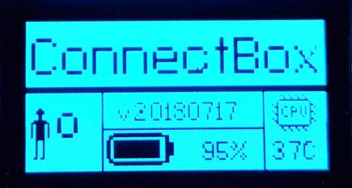<![endif]><o:p></o:p>

<o:p>&nbsp;</o:p>

This
screen shows the number of connected people, the version number of firmware in
the unit, the battery charge level (Note: on a battery less ConnectBox this
area is blank) and the CPU temperature.  .<o:p></o:p>

<o:p>&nbsp;</o:p>

Pressing
the up button again for 1 second with the first status screen on, will bring up
the second status screen.<o:p></o:p>

<!--[if gte vml 1]><v:shape
 id="Picture_x0020_32" o:spid="_x0000_i1041" type="#_x0000_t75" style='width:305.25pt;
 height:166.5pt;visibility:visible;mso-wrap-style:square'>
 <v:imagedata src="ConnectBox-GettingStarted_V7_files/image074.png" o:title=""/>
</v:shape><![endif]--><![if !vml]>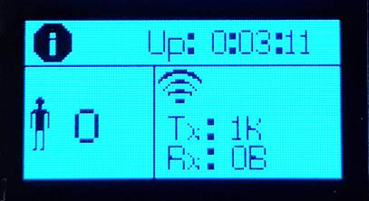<![endif]><o:p></o:p>

<o:p>&nbsp;</o:p>

This
screen shows the time duration that unit has been on, the number of people connected and the aggregate transmit and receive volume of
data the unit has sent/received since powered on.<o:p></o:p>

<o:p>&nbsp;</o:p>

Pressing
the up button again for 1 second with the second status screen on, will bring
up the third status screen:<o:p></o:p>

<o:p>&nbsp;</o:p>

<!--[if gte vml 1]><v:shape
 id="Picture_x0020_6" o:spid="_x0000_i1040" type="#_x0000_t75" style='width:313.5pt;
 height:166.5pt;visibility:visible;mso-wrap-style:square'>
 <v:imagedata src="ConnectBox-GettingStarted_V7_files/image076.png" o:title=""/>
</v:shape><![endif]--><![if !vml]>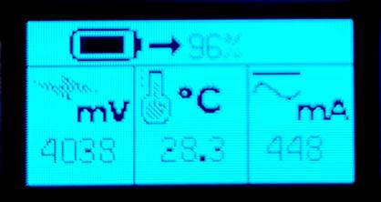<![endif]><o:p></o:p>

<o:p>&nbsp;</o:p>

This
screen shows more detailed information on the battery.  This includes the current battery power level
in %, the voltage of the battery, the temperature of the power control chip and
the current in or out of the battery (as indicated by the directional arrow).  Note that the battery is a 6400 mAh battery or a 3000 mAh battery
depending on model.  On a battery less
unit the % area is blank and the mV area show the voltage input from the power module and current
being drawn from the power module.<o:p></o:p>

<o:p>&nbsp;</o:p>

At
any time after the first screen pressing the down button for 1 second will go
back a screen.<o:p></o:p>

<o:p>&nbsp;</o:p>

Pressing
the up button again for 1 second with the third status screen on, will bring up
the fourth status screen:<o:p></o:p>

<o:p>&nbsp;</o:p>

<!--[if gte vml 1]><v:shape
 id="Picture_x0020_10" o:spid="_x0000_i1039" type="#_x0000_t75" style='width:313.5pt;
 height:170.25pt;visibility:visible;mso-wrap-style:square'>
 <v:imagedata src="ConnectBox-GettingStarted_V7_files/image078.png" o:title=""/>
</v:shape><![endif]--><![if !vml]>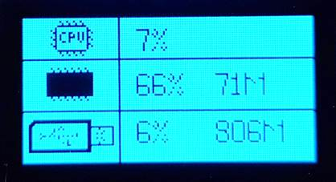<![endif]><o:p></o:p>

<o:p>&nbsp;</o:p>

This
screen shows the amount of CPU usage in %, the amount of RAM memory usage in %
and the amount of USB storage used in %<o:p></o:p>

<o:p>&nbsp;</o:p>

Pressing
the up button again for 1 second with the fourth screen on, will bring up the
fifth status screen:<o:p></o:p>

<o:p>&nbsp;</o:p>

<!--[if gte vml 1]><v:shape
 id="Picture_x0020_12" o:spid="_x0000_i1038" type="#_x0000_t75" style='width:324pt;
 height:171pt;visibility:visible;mso-wrap-style:square'>
 <v:imagedata src="ConnectBox-GettingStarted_V7_files/image080.jpg" o:title=""/>
</v:shape><![endif]--><![if !vml]>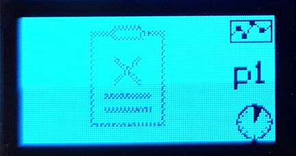<![endif]><o:p></o:p>

<o:p>&nbsp;</o:p>

This
screen shows the most popular downloaded or viewed files on the unit <b>over
the last hour</b>.  This screen show ‘p1’
indicating it is page one of the reports of hourly usage.  Pushing the up button again to see page ‘p2’.  If there is an ‘empty’ clipboard symbol,
there are no statistics to view.  <o:p></o:p>

<o:p>&nbsp;</o:p>

Pressing
the up button again for 1 second with the Sixth screen up will show the Seventh
screen indicating the most popular file activity for the last Day.  The p number represents the page number of
the report (1 or 2). <o:p></o:p>

<o:p>&nbsp;</o:p>

<o:p>&nbsp;</o:p>

<!--[if gte vml 1]><v:shape
 id="Picture_x0020_193" o:spid="_x0000_i1037" type="#_x0000_t75" style='width:287.25pt;
 height:2in;visibility:visible;mso-wrap-style:square' o:bordertopcolor="yellow pure"
 o:borderleftcolor="yellow pure" o:borderbottomcolor="yellow pure"
 o:borderrightcolor="yellow pure">
 <v:imagedata src="ConnectBox-GettingStarted_V7_files/image082.png" o:title=""/>
 <w:bordertop type="single" width="8"/>
 <w:borderleft type="single" width="8"/>
 <w:borderbottom type="single" width="8"/>
 <w:borderright type="single" width="8"/>
</v:shape><![endif]--><![if !vml]><![endif]><o:p></o:p>

<o:p>&nbsp;</o:p>

 <o:p></o:p>

This
screen shows the most popular streamed/downloaded files on the unit for the day.  If there is an ‘empty’ clipboard symbol,
there are no statistics to view.  The p
marker shows which page of the report  (1 or 2) you are looking at.<o:p></o:p>

<o:p>&nbsp;</o:p>

Pressing
the up button again for 1 second with the Eighth  screen on, will bring up the Ninth  status screen showing the most popular
streamed/downloaded files on the unit for the Week.  If there is an ‘empty’ clipboard symbol,
there are no statistics to view.  The p
marker shows which page of the report  (1 or 2) you are looking at.<o:p></o:p>

<o:p>&nbsp;</o:p>

<!--[if gte vml 1]><v:shape
 id="Picture_x0020_37" o:spid="_x0000_i1036" type="#_x0000_t75" alt="A picture containing drawing&#10;&#10;Description automatically generated"
 style='width:263.25pt;height:131.25pt;visibility:visible;mso-wrap-style:square'
 o:bordertopcolor="yellow pure" o:borderleftcolor="yellow pure"
 o:borderbottomcolor="yellow pure" o:borderrightcolor="yellow pure">
 <v:imagedata src="ConnectBox-GettingStarted_V7_files/image084.png" o:title="A picture containing drawing&#10;&#10;Description automatically generated"/>
 <w:bordertop type="single" width="8"/>
 <w:borderleft type="single" width="8"/>
 <w:borderbottom type="single" width="8"/>
 <w:borderright type="single" width="8"/>
</v:shape><![endif]--><![if !vml]><![endif]><o:p></o:p>

<o:p>&nbsp;</o:p>

Pressing
the up button again for 1 second with the Tenth screen on, will bring up the Eleventh
status screen showing the most popular streamed/downloaded files on the unit
for the Month.  If there is an ‘empty’
clipboard symbol, there are no statistics to view.  The p marker shows which page of the report (1
or 2) you are looking at.<o:p></o:p>

<o:p>&nbsp;</o:p>

<!--[if gte vml 1]><v:shape
 id="Picture_x0020_38" o:spid="_x0000_i1035" type="#_x0000_t75" alt="A picture containing drawing&#10;&#10;Description automatically generated"
 style='width:264pt;height:132pt;visibility:visible;mso-wrap-style:square'
 o:bordertopcolor="yellow pure" o:borderleftcolor="yellow pure"
 o:borderbottomcolor="yellow pure" o:borderrightcolor="yellow pure">
 <v:imagedata src="ConnectBox-GettingStarted_V7_files/image086.png" o:title="A picture containing drawing&#10;&#10;Description automatically generated"/>
 <w:bordertop type="single" width="8"/>
 <w:borderleft type="single" width="8"/>
 <w:borderbottom type="single" width="8"/>
 <w:borderright type="single" width="8"/>
</v:shape><![endif]--><![if !vml]><![endif]><o:p></o:p>

<o:p>&nbsp;</o:p>

 

<o:p>&nbsp;</o:p>

Pressing
the up button again for 1 second with the 12th screen on, will bring
up the Memory copy entry screen showing how to enter file copy mode by pressing
both up and down buttons simultaneously for more than 5 seconds.<o:p></o:p>

<o:p>&nbsp;</o:p>

<!--[if gte vml 1]><v:shape
 id="Picture_x0020_39" o:spid="_x0000_i1034" type="#_x0000_t75" alt="A close up of a logo&#10;&#10;Description automatically generated"
 style='width:246.75pt;height:127.5pt;visibility:visible;mso-wrap-style:square'
 o:bordertopcolor="yellow pure" o:borderleftcolor="yellow pure"
 o:borderbottomcolor="yellow pure" o:borderrightcolor="yellow pure">
 <v:imagedata src="ConnectBox-GettingStarted_V7_files/image088.png" o:title="A close up of a logo&#10;&#10;Description automatically generated"/>
 <w:bordertop type="single" width="8"/>
 <w:borderleft type="single" width="8"/>
 <w:borderbottom type="single" width="8"/>
 <w:borderright type="single" width="8"/>
</v:shape><![endif]--><![if !vml]><![endif]><o:p></o:p>

<o:p>&nbsp;</o:p>

<o:p>&nbsp;</o:p>

<o:p>&nbsp;</o:p>

If
no buttons are pressed after 10 seconds, then the screen will go black again to
conserve battery power.  Pressing the Up
button for more than 1 second will again show the first screen.<o:p></o:p>

<o:p>&nbsp;</o:p>

<o:p>&nbsp;</o:p>

If
at any active screen you push and hold both left and right buttons for more
than 5 seconds you will open a file copy menu which is explained in more detail
in the following block diagram:<o:p></o:p>

 

<o:p>&nbsp;</o:p>

<!--[if gte vml 1]><v:shape id="Picture_x0020_196"
 o:spid="_x0000_i1033" type="#_x0000_t75" style='width:430.5pt;height:699.75pt;
 visibility:visible;mso-wrap-style:square'>
 <v:imagedata src="ConnectBox-GettingStarted_V7_files/image090.png" o:title=""/>
</v:shape><![endif]--><![if !vml]>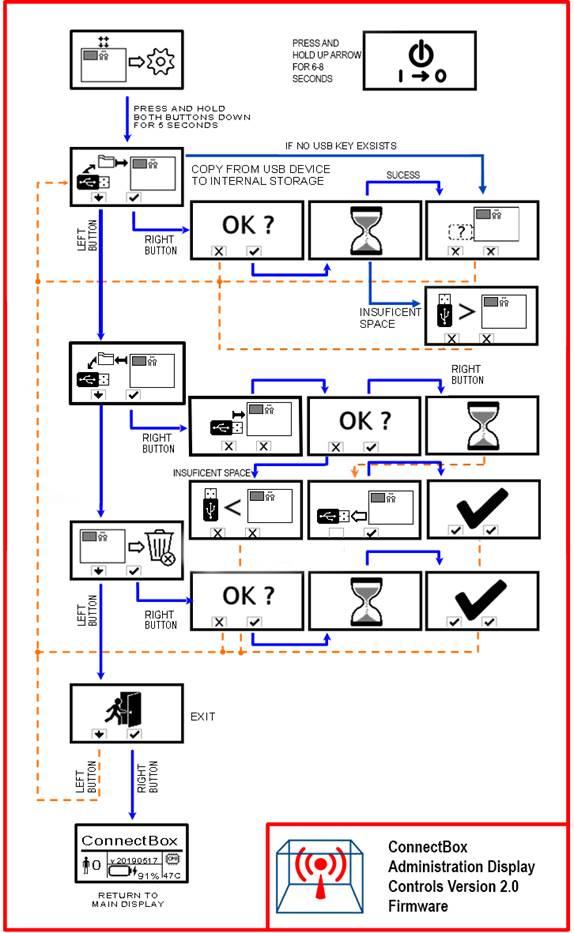<![endif]> 
<o:p></o:p>

<o:p>&nbsp;</o:p>

<h1><a name="_Toc103598844">The Administrator Web Page</a>:<o:p></o:p></h1>

<o:p>&nbsp;</o:p>

Navigate to the Administration area: <a href="http://connectbox/admin">http://connectbox/admin </a> (or press the cog icon on the bottom
right of the screen) 
and login with the default Connectbox
credentials (username and password are case
sensitive):

<o:p>&nbsp;</o:p>

<u>username</u>: admin

<u>password</u>: connectbox

<o:p>&nbsp;</o:p>

<b>Recommended:</b> Change the password for the
Administration area. Go to the Configuration Menu and select Password. Enter a
new password and press submit. When you next try to enter the admin portal of
the Connectbox, you will be prompted to login again. Use the new password when
this happens.

<o:p>&nbsp;</o:p>

                                                  
<!--[if gte vml 1]><v:shape id="Picture_x0020_19"
 o:spid="_x0000_i1032" type="#_x0000_t75" alt="Graphical user interface, application&#10;&#10;Description automatically generated"
 style='width:153pt;height:315.75pt;visibility:visible;mso-wrap-style:square'>
 <v:imagedata src="ConnectBox-GettingStarted_V7_files/image092.jpg" o:title="Graphical user interface, application&#10;&#10;Description automatically generated"/>
</v:shape><![endif]--><![if !vml]>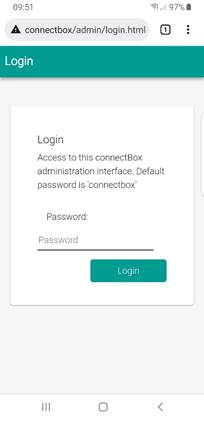<![endif]>

<o:p>&nbsp;</o:p>

<o:p>&nbsp;</o:p>

<a name="_Toc103598845">Configuring your unit</a>:

<o:p>&nbsp;</o:p>

Configuration of your unit is done through the following
pages:

 <b>Password:  </b>allows you to change the system password
for the Administrator functions (Note: we highly recommend changing the
administrator password from the default ‘connectbox’)

<o:p>&nbsp;</o:p>

<!--[if gte vml 1]><v:shape id="Picture_x0020_8"
 o:spid="_x0000_i1031" type="#_x0000_t75" alt="Graphical user interface, application&#10;&#10;Description automatically generated"
 style='width:125.25pt;height:258pt;visibility:visible;mso-wrap-style:square'>
 <v:imagedata src="ConnectBox-GettingStarted_V7_files/image094.jpg" o:title="Graphical user interface, application&#10;&#10;Description automatically generated"/>
</v:shape><![endif]--><![if !vml]><![endif]>

<o:p>&nbsp;</o:p>

Wireless Access Point<b>:</b> change SSID (wireless
display name), select the WiFi channel and increase
security by adding a WPA passphrase

<!--[if gte vml 1]><v:shape id="Picture_x0020_23"
 o:spid="_x0000_i1030" type="#_x0000_t75" alt="Graphical user interface, application&#10;&#10;Description automatically generated"
 style='width:124.5pt;height:255.75pt;visibility:visible;mso-wrap-style:square'>
 <v:imagedata src="ConnectBox-GettingStarted_V7_files/image096.jpg" o:title="Graphical user interface, application&#10;&#10;Description automatically generated"/>
</v:shape><![endif]--><![if !vml]>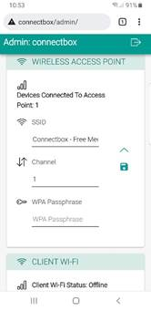<![endif]>

<o:p>&nbsp;</o:p>

<o:p>&nbsp;</o:p>

WiFi Channel:

<o:p>&nbsp;</o:p>

Change the Wi-Fi channel to something that might be less
congested in your area. (Configure -&gt; Channel) Your choices are channels 1 –
11 or 1 – 14 depending on the country. 
It is a <u>suggestion</u> to the media box as it will scan all available
channels in your area based on the country you’re in (from the Client Wi-Fi
country setting) and if appropriate will give you the selected channel or if
another one is better it will select that one.. When
you change the Wi-Fi channel, you will temporarily be disconnected form the
Connectbox until your device reconnects to the Wi-Fi SSID on the new channel.

<o:p>&nbsp;</o:p>

WPA
Passphrase:

Setting a WPA passphrase will force any user wanting to
connect to your Connectbox to have a password to connect.  This is appropriate in places where you want
to control who connects.  The Passphrase
needs to be something easy to remember and should be reasonably long such as a
phrase without spaces, but may contain numbers and
other characters.  Using good practices
for creating a password is the same as creating a good Passphrase.

<o:p>&nbsp;</o:p>

Client Wi-FI:  Allows you to scan and set the SSID of the
access point you want to connect to internet for this device., The Wi-Fi
password needed and the country code where your located to manage the channels
it will look at.

<!--[if gte vml 1]><v:shape id="Picture_x0020_24"
 o:spid="_x0000_i1029" type="#_x0000_t75" alt="Graphical user interface, application&#10;&#10;Description automatically generated"
 style='width:120.75pt;height:248.25pt;visibility:visible;mso-wrap-style:square'>
 <v:imagedata src="ConnectBox-GettingStarted_V7_files/image098.jpg" o:title="Graphical user interface, application&#10;&#10;Description automatically generated"/>
</v:shape><![endif]--><![if !vml]>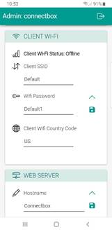<![endif]>

Hostname<b>:<o:p></o:p></b>

<o:p>&nbsp;</o:p>

Change the name of the hostname (by default this is
‘connectbox’) to something of your own choosing. From the admin menu, go to
(WEB SERVER: Hostname). This only appears in the location bar of the browser.
If you are changing the hostname, you will need to use the new <a
href="http://hostname/">http://hostname </a>for
the default web page, or <a href="http://hostname/admin">http://hostname/admin </a>for the administrative
area. Additionally, after the change, you will have to login again as your credentials
were for the last host.  After changing
the hostname press the disk icon to save it and make the change permanent.

<o:p>&nbsp;</o:p>

Uplink
Via Mobile Phone:

<o:p>&nbsp;</o:p>

 This section allows
you to configure the OTG (On the Go) functionality of the device.  This includes allowing the USB C port to be
used as a serial port to your host computer (serial ssh
into the device), or if your device will look like a hard drive to your host
system, etc.  Please refer to the
advanced administrative guide for further information.  NOTE: changing values in these fields have a
direct impact on how the device functions and may cause the device to become
inoperable to the Host.  Only change
these options when you fully understand what you are doing and when you
understand the implications of what you are doing. 

<!--[if gte vml 1]><o:wrapblock><v:shape id="Picture_x0020_40"
  o:spid="_x0000_s2103" type="#_x0000_t75" alt="Graphical user interface, text, application&#10;&#10;Description automatically generated"
  style='position:absolute;margin-left:197.1pt;margin-top:8.85pt;width:135.6pt;
  height:278.75pt;z-index:-251662336;visibility:visible;mso-wrap-style:square;
  mso-width-percent:0;mso-height-percent:0;mso-wrap-distance-left:9pt;
  mso-wrap-distance-top:0;mso-wrap-distance-right:9pt;
  mso-wrap-distance-bottom:0;mso-position-horizontal:absolute;
  mso-position-horizontal-relative:text;mso-position-vertical:absolute;
  mso-position-vertical-relative:text;mso-width-percent:0;mso-height-percent:0;
  mso-width-relative:margin;mso-height-relative:margin'>
  <v:imagedata src="ConnectBox-GettingStarted_V7_files/image100.jpg" o:title="Graphical user interface, text, application&#10;&#10;Description automatically generated"/>
  <w:wrap type="topAndBottom"/>
 </v:shape><![endif]--><![if !vml]>
 <table cellpadding=0 cellspacing=0 align=left>
  <tr>
   <td width=263 height=0></td>
  </tr>
  <tr>
   <td></td>
   <td>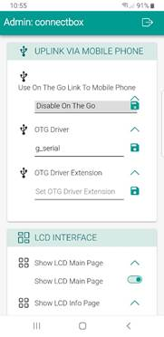</td>
  </tr>
 </table>
 <![endif]><!--[if gte vml 1]></o:wrapblock><![endif]--> 

LCD
Interface: 

<o:p>&nbsp;</o:p>

This section allows you to configure what menu options are
available on the front panel of the device. 
Each page of the device can be turned on or off depending on the values
set.  Note: when you set Show LCD Admin
Pages to off , then all administrative pages are
disabled.

<o:p>&nbsp;</o:p>

<!--[if gte vml 1]><v:shape id="Picture_x0020_20"
 o:spid="_x0000_i1028" type="#_x0000_t75" alt="Graphical user interface, application&#10;&#10;Description automatically generated"
 style='width:128.25pt;height:264.75pt;visibility:visible;mso-wrap-style:square'>
 <v:imagedata src="ConnectBox-GettingStarted_V7_files/image102.jpg" o:title="Graphical user interface, application&#10;&#10;Description automatically generated"/>
</v:shape><![endif]--><![if !vml]>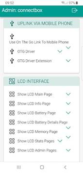<![endif]>

System:

<o:p>&nbsp;</o:p>

 The system menu
items allow you to Sync with the Cloud based host package server.  This will sync your statistical information
as well as pull down any additional configuration items setup by the
organization.  This operation will occur
naturally if the device is connected to the Internet providing Wi-Fi hotspot
configured in the Client WiFi. or by tethering your
unit to your mobile phone through the USB C connection.

However, this button enables you to ensure that the
information is transmitted. 
Additionally, you are able to shut down the
system safely or reboot the system safely from this menu.  The shutdown button allows you to quickly
shut the system down if individuals are looking for the device remotely.  It will then power off as well.<b><o:p></o:p></b>

<b><o:p>&nbsp;</o:p></b>

Shutting
Down the Unit<b>:</b><i
style='mso-bidi-font-style:normal'><o:p></o:p></i>

Will shut down the ConnectBox remotely – Note: power is
still on, but all functions will stop and the Wi-Fi
signal will stop. To reduce battery, drain, turn the power switch off.  (This can be used in creative access
countries to quickly shut the unit down without having to touch the unit)

<o:p>&nbsp;</o:p>

Rebooting
the Unit<b>:<o:p></o:p></b>

Will shut down and restart the ConnectBox – Note: it will
take several seconds before the Wi-Fi signal goes away and comes back again.
This forces all attached devices to disconnect and then have
to reconnect to use the ConnectBox.

<o:p>&nbsp;</o:p>

Logs &amp; System Info<b>:  </b>This section is for diagnostics about the
system status.  Please only use these
when requested by a service person attempting to assist in determining what is
if anything wrong with your device.  It allows
internal view of the Wi-Fi status as well as other elements.<b><o:p></o:p></b>

<b><o:p>&nbsp;</o:p></b>

Reports<b>:  </b>This section allows you to look at and
download the top 10 open well requests from the last hour, day, week, month, or
year.  Additionally, all requests for the
Year, Month or Week can be downloaded or viewed.  These reports allow you to better understand
what is important to your users and what they have been looking/downloading.  These reports are part of the information
that is sent to the Cloud based host package server when you connect to the
Internet either by Client Wi-Fi or by tethering your unit to your mobile phone
through the USB C connection.<b><o:p></o:p></b>

<!--[if gte vml 1]><v:shape id="Picture_x0020_42" o:spid="_x0000_i1027"
 type="#_x0000_t75" alt="Graphical user interface, text, application&#10;&#10;Description automatically generated"
 style='width:135.75pt;height:279pt;visibility:visible;mso-wrap-style:square'>
 <v:imagedata src="ConnectBox-GettingStarted_V7_files/image104.jpg" o:title="Graphical user interface, text, application&#10;&#10;Description automatically generated"/>
</v:shape><![endif]--><![if !vml]>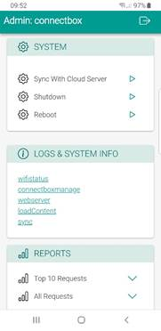<![endif]><o:p></o:p>

<o:p>&nbsp;</o:p>

<o:p>&nbsp;</o:p>

About<b>:  </b>This section gives you an overview of the
history of the firmware/software that is used by the Connectbox and the
organizations who have contributed to make is possible.

<b><o:p>&nbsp;</o:p></b>

Storage<b>:  </b>This final element of the admin menu
allows you to immediately erase all content on the unit.  It does this first by deleting all files and
folders then by moving on to overwrite all content areas with random data
patterns to ensure that the data is not recoverable if the device is found or
investigated.  Note that it takes some
time to wipe the data in this way.  Also
note that you will have fully erased all content from your device.  To make it usable again you will have to
reload the content packages form the Cloud based host package server or form a
USB key.<b><o:p></o:p></b>

<b
style='mso-bidi-font-weight:normal'><!--[if gte vml 1]><v:shape
 id="Picture_x0020_43" o:spid="_x0000_i1026" type="#_x0000_t75" alt="Graphical user interface, text, application, email&#10;&#10;Description automatically generated"
 style='width:131.25pt;height:269.25pt;visibility:visible;mso-wrap-style:square'>
 <v:imagedata src="ConnectBox-GettingStarted_V7_files/image106.jpg" o:title="Graphical user interface, text, application, email&#10;&#10;Description automatically generated"/>
</v:shape><![endif]--><![if !vml]>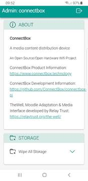<![endif]><o:p></o:p></b>

                                                   

<h2 style='text-indent:21.0pt'><a name="_Toc103598846">Enabling SSH for the
device:</a></h2>

<o:p>&nbsp;</o:p>

There is a way to enable SSH
into the unit on boot.  This is
accomplished by plugging in a USB Flash drive with the following structure:

                                    root
directory: &#9472;.connectbox<o:p></o:p>

                                                                    &#9492;&#9472;&#9472;  enable-ssh<o:p></o:p>

<b><o:p>&nbsp;</o:p></b>

Note that the directory is
(dot) connectbox with a single file enable-ssh that
can be blank or empty.

<o:p>&nbsp;</o:p>

As soon as this is plugged in
to the device it will activate the SSH for the root account.

<o:p>&nbsp;</o:p>

<a name="_Toc103598847">Upgrading the firmware with
interim patches</a>:

<o:p>&nbsp;</o:p>

It is possible that interim patches
will be released for V2 firmware.  These
patches are applied in the following manner. 
Using a clean USB flash drive load the patch code into the following
directory structure:

                                    root
directory: &#9472;.connectbox - upgrade<o:p></o:p>

                                                                 
                    &#9500;&#9472;&#9472; Prerun<o:p></o:p>

                                                               
                      &#9500;&#9472;&#9472; Postrun<o:p></o:p>

                                                                                      &#9500;&#9472;&#9472; update<o:p></o:p>

                                                                                     
&#9500;&#9472;&#9472; CM4version<o:p></o:p>

                                                                                      &#9492;&#9472;&#9472;  upgrade.py<o:p></o:p>

<o:p>&nbsp;</o:p>

When this USB flash drive is inserted,
the operating system will detect the upgrade folder and look for the upgrade.py
file.  If it exists, it will then copy
the upgrade code/directories to the internal memory and execute the
upgrade.  If successful it will then will
create an Upgrade xxxzxxxx.log file in the uSD directory /usr/local/connectbox/ .  Additionally, it
will delete the folders and upgrade.py file from the /tmp
directory.   If the upgrade failes, you will get a message on the display indicating
failure and an error code.  Contact <a
href="mailto:help@connectbox.org">help@connectbox.org</a> for additional
assistance.  If the upgrade was
successful, you will receive a notice of success on the screen and you can
remove and reformat the USB flash drive you used.

<o:p>&nbsp;</o:p>

<o:p>&nbsp;</o:p>

<a name="_Toc103598848">Enabling Custom Web Interface</a>:

<i style='mso-bidi-font-style:normal'><o:p>&nbsp;</o:p></i>

By default, your ConnectBox is
configured to run using what we call the “Enhanced User Interface”. In this
mode, the content that is displayed in your end user’s browser is either a
single piece of media which has a thumbnail generated for it (such as a frame
from a video) or an Icon indicating the type of media it is along with a
name.  If you need to host a unique
website for your application, please refer to <b>Creating a unique website
configuration document</b>.  This
document explains how to create a unique website or to install other web tools
such as WordPress.

<o:p>&nbsp;</o:p>

<o:p>&nbsp;</o:p>

<o:p>&nbsp;</o:p>

<a name="_Toc103598849">Enabling Custom WordPress installation</a>:

<o:p>&nbsp;</o:p>

If you desire to create your own web interface using
the NGINX server, you can do so by following the <b>Configuring a ConnectBox
for WordPress document</b>.<o:p></o:p>

<o:p>&nbsp;</o:p>

<a name="_Toc103598850">Linking your Connectbox to
Control Host</a>:

<o:p>&nbsp;</o:p>

The connectbox can be run independently in the field or it
can be connected periodically to a control host system for an organization or
for reporting of statistical information for media being used from another
vendor.  The host management system allows
for content packages to be prepared for download to specific Connectboxe’s.  It also allows for return uploading of
statistical information from the connectbox in the field.  This is done by connecting the connectbox to
the internet periodically either through an access point with internet access,
or through a mobile phone with a data plan tethered to the connectbox. (Note an
access point can simply be a local sharing of your mobile data plan as a
hotspot for the connectbox to connect to.)

<o:p>&nbsp;</o:p>

The following diagram outlines the general approach for
remote Connectboxe’s being integrated into the Control Host:

<o:p>&nbsp;</o:p>

<!--[if gte vml 1]><v:shape
 id="Picture_x0020_3" o:spid="_x0000_i1025" type="#_x0000_t75" alt="Diagram&#10;&#10;Description automatically generated"
 style='width:549pt;height:430.5pt;visibility:visible;mso-wrap-style:square'>
 <v:imagedata src="ConnectBox-GettingStarted_V7_files/image108.png" o:title="Diagram&#10;&#10;Description automatically generated"/>
</v:shape><![endif]--><![if !vml]>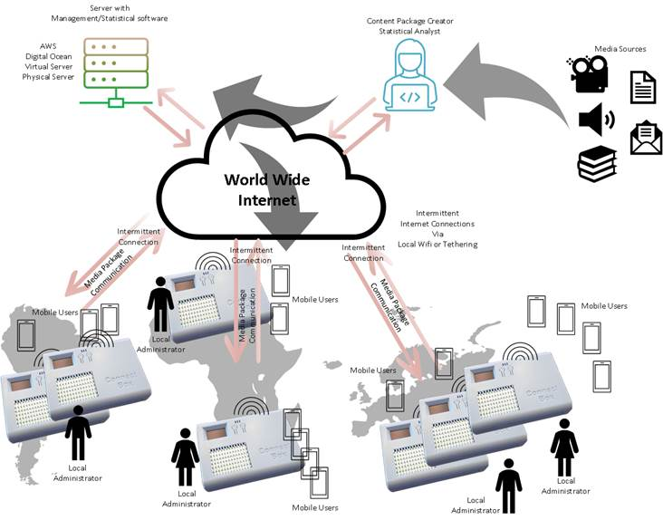<![endif]>

Here media is prepared by the content package creator
through the package manager interface of the Control Host system.  These packages are then queued for download
to the individual Connectboxe’s based on unique ID of the box and
location/local administrator.  When the
local connectbox has an internet connection either through an Access Point (AP)
or by the local administrator connecting it to one, the media package will be
downloaded and installed.  Simultaneously
it will have its media usage statistics sent to the Control Host system.  The Content package creator/or Statistical
analyst can then aggregate the information of media usage across units to
provide reporting to media vendors that created the content.  There are specific role responsibilities in
this model.

<![if !supportLists]>1)&nbsp;&nbsp;&nbsp;&nbsp;&nbsp;
<![endif]>Local Administrator, their job is to secure the unit,
manage the units’ capabilities locally, connect it periodically to the internet
for retrieval of new content as well as reporting of content usage.

<![if !supportLists]>2)&nbsp;&nbsp;&nbsp;&nbsp;&nbsp;
<![endif]>The Media content creator job is to prepare the
packages of media that each unique unit needs as well as to oversee the
ensuring of periodic reporting in of the individual boxes from the field
through the return of data from the units.

<![if !supportLists]>3)&nbsp;&nbsp;&nbsp;&nbsp;&nbsp;
<![endif]>The Statistician who’s job it is to aggregate the
statistical information from the Host Controller system and report back to the
media providers and internally to the organization.

<![if !supportLists]>4)&nbsp;&nbsp;&nbsp;&nbsp;&nbsp;
<![endif]>The System Administrators job is to setup and mange the
Control Host System.  This is done either
virtually on an Amazon Web Server or other hosting provider, or locally on
physical hardware.  The are to ensure the
ongoing maintenance and patching of software to ensure security of the system.

<o:p>&nbsp;</o:p>

To facilitate the deployment of the Connectboxe’s for an organization,
we have prepared the Host Controller software system installation packages for
AWS servers as well as other providers like Digital Ocean through Ansible
script files.  This will create the
structure on the server and provision it. 
Additional DNS records management may be needed to ensure that the
ConnectBox’s and system users have easy access to this control system.

<o:p>&nbsp;</o:p>

<b>Please refer to the documentation on setup and
configuration of the control system as well as management and use of the
content creator and statistical reporting sides</b>.  This will also then provide the information
needed in setting up the individual Connectboxe’s.

 

<o:p>&nbsp;</o:p>

<o:p>&nbsp;</o:p>

                                                                     
<o:p></o:p>

<h2><a name="_Toc103598851">Features:</a></h2>

<o:p>&nbsp;</o:p>

The
Connectbox can be ordered in four models:<o:p></o:p>

<o:p>&nbsp;</o:p>

            Battery Version with 6,400 mAh battery                          Model
P V6,  Model P
V7<o:p></o:p>

            Non-Battery Version with power
module only                Model S V6,  Model S V7<o:p></o:p>

<o:p>&nbsp;</o:p>

Model
P version is larger and a bit heavier due to the battery:<o:p></o:p>

<o:p>&nbsp;</o:p>

            109mm L x 80mm W x 28mm H<o:p></o:p>

            208 g Weight<o:p></o:p>

<o:p>&nbsp;</o:p>

Model
S version is smaller due to the lack of the battery:<o:p></o:p>

<o:p>&nbsp;</o:p>

            73mm L x 80mm W x 28mm H<o:p></o:p>

            99 g Weight<o:p></o:p>

<o:p>&nbsp;</o:p>

<o:p>&nbsp;</o:p>

Both of the A and B versions can be ordered with two
accessories:<o:p></o:p>

<o:p>&nbsp;</o:p>

            Accessory 1:<o:p></o:p>

                        Metal tie wrap to attach
the Connectbox to another object/anchor to keep it from being<o:p></o:p>

                        removed.   Once attached the only way to detach it is
to cut the metal tie-wrap.<o:p></o:p>

<o:p>&nbsp;</o:p>

            Accessory 2:<o:p></o:p>

                        Miro-SD card cover that
can be inserted inside of the unit to keep the micro-SD card from <o:p></o:p>

                        being removed without
opening the case.  This accessory can be
retrofitted into existing<o:p></o:p>

                        Connectbox version 6
units or later.  But is best if
pre-ordered with the unit.<o:p></o:p>

<o:p>&nbsp;</o:p>

<o:p>&nbsp;</o:p>

<o:p>&nbsp;</o:p>

This is an open
source project and we appreciate your feedback and suggestions. Please
visit: <a href="http://feedback.connectbox.technology/">http://feedback.connectbox.technology/ </a>and leave your
comments. Anything posted here will automatically go directly to the developers
for consideration.

<o:p>&nbsp;</o:p>

<o:p>&nbsp;</o:p>

<o:p>&nbsp;</o:p>

ConnectBox Homepage: <u
style='text-underline:blue'>https://connectbox.technology/wp/</u>

<o:p>&nbsp;</o:p>

ConnectBox Development Source
Code: <a href="https://github.com/ConnectBox">https://github.com/ConnectBox</a><u
style='text-underline:blue'><o:p></o:p></u>

<o:p>&nbsp;</o:p>

 
ConnectBox Discussion Forum:  <a
href="https://groups.google.com/forum/#!forum/connectbox">https://groups.google.com/forum/#!forum/connectbox</a>

</body>

</html>
