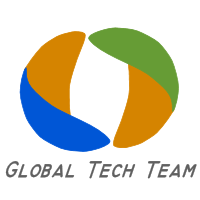
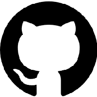

# About/Contact

For more information about the project, send an email to: <connectboxes@globaltech.team>

## Team Members:

|    | **GeoDirk** - <https://github.com/GeoDirk> A former environmental geologist turned computer programmer who has worked for way too many different engineering firms and spent too many long days sitting next to a drilling rig on toxic waste sites staring at nasty chemicals through an uncomfortable respirator mask.  Currently involved with pretty much all aspects of this project helping to bring it all together; from coding, case design, testing, circuit board tinkering, and overall direction. |
|:---:|:---|
|    | **Next Person:**  Some text about person |
|    | **Next Person:**  Some text about person |
|    | **Next Person:**  Some text about person |

## Partners:

## Join the team:

### Fork us on Github!